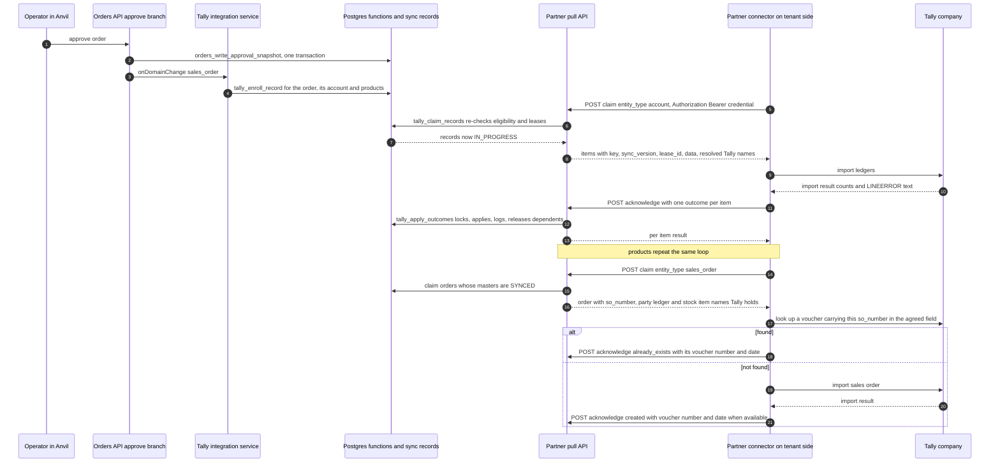
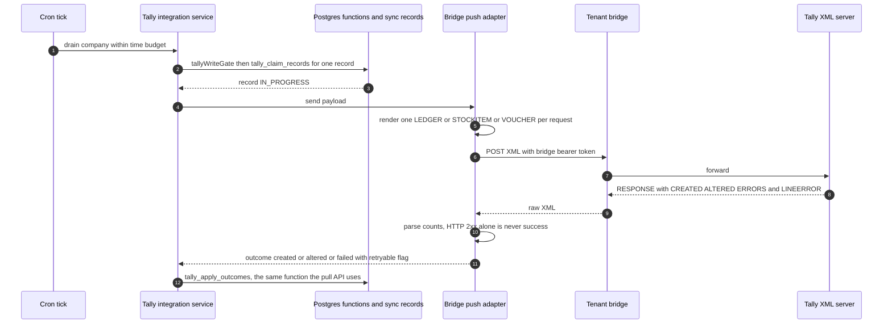
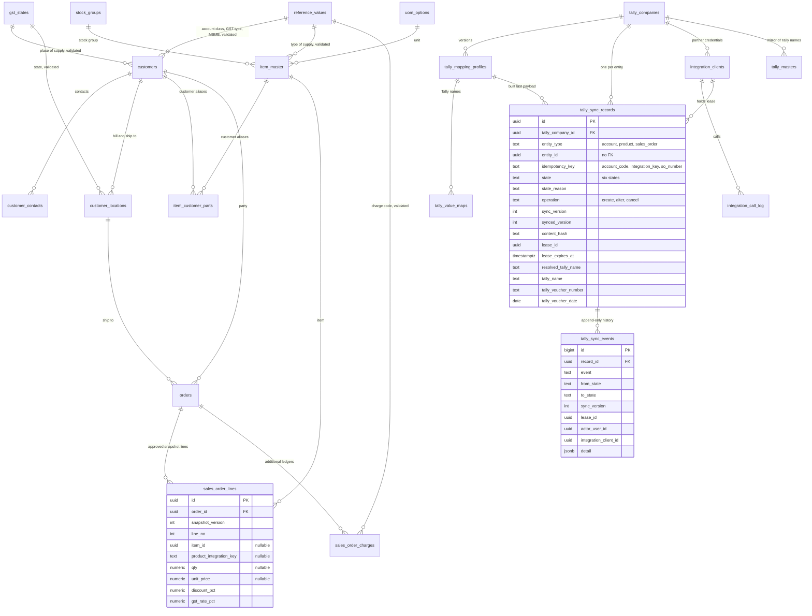

# Tally ERP integration for any tenant: scope

Scoping note, 2026-10-05, revised the same day after review. This is a design only; nothing is built. It is grounded in:
- origin/main 1f45d83f;
- seven verified subsystem maps covering Tally, customers, items, orders, platform, UI and docs (where a verification disagreed with its map, the verification wins);
- the first candidate tenant's field-mapping workbook and its Tally partner's two request collections (sanitized copies only);
- two pages of Tally's public developer reference ("Sample XML" and "Case study using XML", which carries the XML request and response formats), read 2026-10-05.

The owner narrowed the request before this was written: *"We are not looking to implement their tokens and APIs. We are trying to design to make Tally ERP integration work for any future customers (maybe Obara)."* Everything below is tenant-agnostic. The workbook and the collections show what Tally needs and one way of integrating with it. Anvil does not serve them as a contract.

---

## 0. The goal in one page

**Goal.** Any Anvil tenant whose books run on TallyPrime or Tally.ERP 9 can have the accounts, products and approved sales orders that Anvil owns appear in its Tally company:
- each exactly once;
- masters before the vouchers that name them;
- with every attempt and every acknowledgement recorded;
- through whichever transport that tenant's Tally side can support.

Tally stays the ERP and the books. Anvil owns the commercial records and the workflow that approves them.

**Obara is the first worked example, not the design.** Its partner's workbook becomes the first *mapping profile* (data, not columns). Its partner already pulls records and posts acknowledgements back. That becomes the first *transport*, generalised under Anvil's own endpoint names, header auth and per-tenant credentials. Anything that only Obara needs lives in that profile: a print-name UDF, a cap of four customer aliases per product, a one-crore credit-limit ceiling.

**What this is not.**
- No Salesforce-compatible routes.
- No translation of Salesforce record ids.
- No query-string token scheme.
- No Tally logic inside `customers`, `item_master` or `orders`. Some domain tables need a guard: a key that must stop changing, or an order that must not be cancelled while another system holds it. Each such guard is a neutral domain fact set through a neutral seam, and it names no ERP (§3.1, §4.2 migrations 234 and 235).
- No Tally-side connector. Whatever talks to Tally's XML server is either the tenant's Tally partner (pull) or a tenant-run bridge (push). Neither lives in this repo.

**What Anvil has today.** Anvil already has a *push* path:
- a server-side XML voucher builder (`src/api/_lib/tally-build-voucher.js:252-370`);
- POSTed with a bearer token to a per-tenant bridge that forwards to Tally's XML port (`src/api/_lib/tally-client.js:1-29, 72-88`; `docs/INTEGRATIONS.md:92-111`);
- plus a retry drain, a reverse sync and a drift reconciler.

That path has four limits:
- It sends vouchers only, never ledgers or stock items (`tally-build-voucher.js:333` emits only `REPORTNAME Vouchers`).
- The bridge program is not in the repo.
- No tenant has ever connected it, so none of the 11 files under `src/api/tally/` has ever sent or received data (`docs/MODE_A_B_SCOPE.md:12-16, 57-63`).
- It has verified defects that can post one order twice (§1.6).

Anvil also lacks:
- an endpoint a Tally partner can pull from;
- any acknowledgement concept;
- per-record sync state;
- a CRM sales order number;
- a sales order line table;
- an accounting snapshot.

It does have the right *patterns*:
- a hashed, scoped, revocable machine credential (`supabase/migrations/027_mcp_tokens.sql:13-60`);
- a revision hash bound to approval (`src/api/_lib/payload-hash.js:28-70`);
- Tally-shaped item masters (migration 105);
- a per-customer alias table (`item_customer_parts`);
- a tenant switch over who processes sales orders (migration 221);
- a three-way verifier that reads what Tally actually recorded (`src/api/_lib/three-way-report.js`).

**Recommendation.** Add one *Tally integration service*:
- It keeps one record per (Tally company, entity) in one new table with a real state machine.
- Domain hooks and a sweep feed it. The sweep also enrolls entities created by a writer that has no hook.
- One eligibility function gates it, and the claim re-checks it.
- Every state change runs inside a Postgres function, because supabase-js has no transactions.
- Interchangeable transports serve it.

Build the **partner pull-and-acknowledge API first**, for three reasons:
1. It needs no inbound port on the tenant's network.
2. The first tenant's Tally side already works that way.
3. The existing push path has never run. It would need master builders and an import-result parser before it could be trusted.

Move the bridge push onto the same records second. Offer a file export only when a tenant asks.

Domain tables gain only concepts every Indian Tally tenant has:
- party code and account class;
- GST registration type and place of supply;
- MSME details and HSN date;
- CRM SO number, normalized snapshot lines, order charges and narration.

Two values are derived rather than stored twice. Credit period comes from the existing payment terms, and stock category from the existing item category.

Everything named after Tally lives in a versioned per-company mapping profile: ledger groups, sales and GST ledger names, unit symbols, voucher types, UDFs and alias caps.

**Two owner decisions sit above all of this.**
- **Is Anvil the system of record?**
  - The owner's recorded positioning is "not to be another ERP or CRM" (`docs/LANDING_PAGE_BACKLOG.md:9-10`).
  - `docs/GAP_ANALYSIS.md:495` warns against CRM hygiene for its own sake.
  - Nobody has decided whether Anvil replaces a tenant's CRM as the system of record. PR #547 already carries the adjacent question as its D1 ("Who is this built for?").
- **Does Mode B cover masters?**
  - Migration 221 defines Mode B as who processes the *sales order* (`221_so_processing_mode.sql:3-8`).
  - Whether Mode B also stops Anvil-owned accounts and products from reaching Tally is not decided (O17).
  - Until it is, the gate refuses masters under Mode B too. That is the conservative reading.

This design is useful under either answer to the first:
- **Yes:** Anvil enrolls accounts and products as Tally masters.
- **No:** the tenant keeps its CRM and sets master enrollment to `manual` or `off`. It links Anvil records to the ledgers and stock items Tally already holds (§6.2), and lets Anvil send only approved sales orders.

---

## 1. Phase 1 discovery

### 1.1 Stack, deployment, routing

| concern | what Anvil does | evidence |
|---|---|---|
| runtime | Vercel serverless, one function. Every endpoint is a row in `STATIC_ROUTES` dispatched by `api/dispatch.js`, because of the Hobby plan's 12-function cap | `src/api/router.js:1-5, 601, 1162, 1218-1236, 1255-1302`; `api/dispatch.js:24-28` |
| URL space | `vercel.json` rewrites `/api/:p*` to `api/dispatch.js`; `maxDuration` 60 s | `vercel.json:7-10, 39-40` |
| existing Tally routes | `/tally/amend, masters, push, reconcile, drift_addon, validate, companies, health, diagnostics, retry, sync` | `src/api/router.js:1133-1143` |
| environments | Production and Preview only. Preview shares one Supabase across all PRs. No UAT, no `VERCEL_ENV`/`APP_ENV` discriminator | `docs/DEPLOY.md:9-18` |
| cron | an external cron service hits a tick that fans out; `tally/retry` and `tally/sync` run every 5 min | `src/api/cron/tick.js:89, 109-113`; `docs/CRONS.md:8` |

### 1.2 Database

Supabase Postgres with RLS. The API uses the **service role**, so:
- access rules live in handler code;
- RLS-only guarantees do not bind the backend. An example is the append-only policy on `audit_events` (`058_audit_events_append_only.sql:20-24, 40-43`).

RLS conventions and their audit:
- Every table-creating migration since 200 enables RLS with tenant policies (203, 206, 209, 212).
- `src/scripts/audit-rls-coverage.mjs:38-64` lists the tenant tables whose handler queries must filter by tenant.
- `:69-75` allow-lists the sites that are intentionally cross-tenant.
- `npm run verify` fails on a finding.

Migrations are numbered SQL files **applied by hand**:
- main ends at `226_delivery_note_kind.sql`;
- 227 to 231 are reserved by PR #547 (a local branch `feat/account-owner` already holds `227_customer_owner.sql`);
- new migrations here start at **232**.

How CI runs migrations:
- It applies every migration once, in order, to a throwaway Postgres 16 (`.github/workflows/ci.yml:36-60`, `scripts/db/apply-migrations.sh`).
- Each file runs through one sequential `psql -f` session (`apply-migrations.sh: run_sql`).
- It never re-applies a migration, so idempotency is not tested today.
- A `.sql` file alone cannot test two-session behaviour (locks, `skip locked`).

Supabase-js has no transactions, and there is no transaction helper in `src/api/_lib`. Multi-step atomic writes in this repo go through Postgres functions called by RPC: `next_invoice_number` (`012_invoices.sql:101-118`) is called from `src/api/_lib/invoicing.js:30-41`.

### 1.3 Modules and API framework

Handlers are plain ES modules under `src/api/<area>/`, with shared logic in `src/api/_lib/`. Relevant helpers:
- `readBody` caps a streamed body at 1 MiB. It returns a body the runtime already parsed untouched, so a JSON body on Vercel skips the cap and only the platform limit applies (`src/api/_lib/cors.js:61-66`).
- `sendError` returns `{error:{message,status}}`, drops `err.code` and echoes the raw message (`cors.js:50-54`).
- The dispatcher has no request id and no global error wrapper (`router.js:1255-1302`).

### 1.4 Auth

`resolveContext` accepts only Supabase user JWTs and returns `{user, tenantId, role, anonymous}` (`src/api/_lib/auth.js:96-172`). The actor id is `ctx.user.id`.

`hasAction` admits every role for an action missing from `SERVER_ACTIONS` (`auth.js:236`). Every new action must therefore be registered in `auth.js` and `src/v3-app/lib/rbac.ts` together.

Machine access today:

| mechanism | shape | fit |
|---|---|---|
| `mcp_tokens` + `mcp_call_log` | random 32 bytes, sha256 at rest, tenant on the row, scopes, expiry, revocation, per-call log; read from the Authorization header | the pattern to copy (`027_mcp_tokens.sql:13-60`; `src/api/_lib/mcp.js:27-83`; `src/api/mcp/server.js:30-50`). No screen issues them (`src/client/anvil-client.js:568-573` has no caller) |
| `portal_tokens` | plaintext at rest, read from `?token=` | anti-pattern (`022_customer_portal.sql:12`; `src/api/_lib/portal-auth.js:75-78`) |
| `CRON_SECRET`, inbound email/WhatsApp tokens | one secret for all tenants; inbound ones let the caller pick the tenant by header | anti-pattern (`src/api/email/inbound.js:123-140`; `src/api/whatsapp/inbound.js:172-180`) |

### 1.5 Tests

Vitest runs under `src/v3-app/` against a **mocked** Supabase (`ci.yml:30-34` comment). Handler tests import the handler and stub the client.

Precedents to extend: `api-mcp.test.js`, `api-router.test.js`, `api-webhook-fail-closed.test.js`, `api-tally-build-voucher.test.js`, `api-item-customer-parts-upsert.test.js`.

Several shipped defects survived because a test mocked the broken function:
- contacts PATCH (`CustomerContactsPanel.test.tsx:26`);
- reconciler `markStatus` (`api-tally-reconcile-endpoint.test.js:53`);
- the 42P10 upsert in `customer-external-ids.js:108-113`.

### 1.6 Existing Tally and ERP integration mechanisms

**Bridge client.** `src/api/_lib/tally-client.js:1-29, 72-88, 112-136`. Wired, never run live.
- POSTs XML to `<bridge_url>`; GET `/health`; POST `/sync`, `/payments`, `/amend`; Bearer token.
- Anvil is always the HTTP client.
- It needs a tenant-run listener "on a public-or-VPN URL" (`docs/INTEGRATIONS.md:100-105`).
- The bridge program is not in the repo.

**Voucher builder.** `src/api/_lib/tally-build-voucher.js:148-370`. Wired. It holds the only Tally mapping in code:
- stock item = `_mapped_item.part_no` (148-156);
- party = a phantom `customer.tally_ledger`, else `customer_name` (172-176);
- invented sales ledger names (178-185);
- GST ledger names that use the full rate for each half (187-193, 310-313);
- its own state map (195-216);
- no discount, HSN, charges or narration (302-317);
- `REFERENCE` = the PO number (323);
- `COUNTRYOFRESIDENCE` hardcoded to India (345);
- it refuses unmapped lines at build time (262-273).

**`POST /api/tally/push`.** `src/api/tally/push.js:57-268`. Wired. It holds today's de facto eligibility gates:
- Mode B (82-97);
- approval hash (117-119);
- quote variance (131-143);
- the caller's hash against the stored `order.payload_hash` (145-148);
- unresolved blocker (151-154);
- unmapped lines (165-177).

It also has defects that matter here:
- voucher number is `'SO:'+po_number` (162);
- the idempotency lookup is on `(voucher_no, payload_hash)` (193-201);
- HTTP 2xx is treated as success (206);
- it stores no payload (213-229);
- it writes `orders.status` directly (232-235).

**Copilot enqueue and retry drain.** `src/api/_lib/tally-enqueue.js:13-56`; `src/api/copilot/confirm.js:83-90`; `src/api/tally/retry.js:18, 58-124`. Wired. This is a second writer into Tally:
- it skips the Mode B, variance and blocker gates;
- `voucher_record_id` is null (`tally-enqueue.js:41-43`);
- the drain has no claim and no already-exported check, and never re-reads the order;
- it gives up after 5 attempts (`retry.js:9, 29`; `016_tally_v2.sql:106`).

**`/api/tally/validate` dry run.** `src/api/tally/validate.js:61-84, 92-99`. Routed, with no screen caller. A third writer: it POSTs caller-supplied XML to the bridge root under `read` permission.

**Voucher type resolver.** `src/api/_lib/tally-voucher-type.js:26-29`; `110_tally_voucher_type_per_company.sql:22-23`. Wired.
- The default is the accounting `Sales` voucher.
- No API writes `default_sales_voucher_type` (`src/api/tally/companies.js:76-86, 115-116`).
- The per-request override never reaches the XML (`tally-build-voucher.js:275-276`).

**`tally_companies`.** `016_tally_v2.sql:32-53`. Wired; per-tenant and multi-company.
- The bridge token is encrypted, but stored in plaintext when `ANVIL_SECRETS_KEY` is unset (`tally-client.js:43-45`).
- There is no environment or transport column.
- `default_party_group` (016:44) and `default_voucher_series` are read by nothing.
- A tenant without a row silently uses the global env bridge (`tally-client.js:154-163`).
- DELETE is a hard delete whose comment relies on cascades (`companies.js:8, 142-155`).

**`tally_voucher_records`, `tally_retry_queue`, `tally_sync_runs`.** `001_init.sql:288-302`; `016_tally_v2.sql:96-129, 187-203`. Partial, and shaped around push:
- order-only, with `voucher_no NOT NULL`;
- cascade-deleted with the order;
- statuses `pending/validated/dry_run_ok/exported/imported/failed` and `pending/succeeded/gave_up`.

**`tally_masters` mirror.** `001_init.sql:276-286`; `src/api/tally/masters.js:7-83`. The read side is wired; the writer has no caller.
- It copies Tally to Anvil, per tenant (`unique (tenant_id, master_type, name)`, 001:283).
- The writer upserts on exactly that constraint (`masters.js:52`).
- `replace=true` deletes every row of a type (40-43).
- It promotes debtor ledgers into `customers` (55-75), the reverse of the CRM owning the masters.

**Drift reconciler.** `src/api/_lib/tally-reconciler.js:157-159, 222-228, 325-329, 463-470`. Partial and broken:
- it selects columns that do not exist, so every voucher reads as missing;
- its auto-fix inserts the wrong columns;
- `markStatus` writes order statuses that are not in the enum.

**Mode A/B.** `221_so_processing_mode.sql:1-45`. Wired. It is the only switch over who writes to Tally. The gate exists only at `push.js:82-97` and fails open (84-88). Enqueue, retry, confirm and validate do not read it.

**Three-way report.** `src/api/_lib/three-way-report.js`, `three-way-adjudicate.js`; routes `router.js:673-674`. Wired. It verifies an extracted Tally sales order PDF against the PO and Anvil with no bridge. Voucher number and date have authority "none" (`docs/MODE_A_B_SCOPE.md:283-301`).

**Non-Tally ERP push.** `146_erp_export_ledger.sql:21-48`; `src/api/_lib/erp-export-ledger.js` (excludes Tally at 20-21); 16 `*/push.js`. Wired.
- A success-only ledger per (order, connector, payload hash), with a `PAYLOAD_HASH_CHANGED` block.
- A `<erp>_field_map` jsonb per connector on `tenant_settings` (`017_sap_connector.sql:23` and siblings), applied by `dotGet/dotSet` (`src/api/sap/push.js:18-48`).
- `<erp>_sync_state`, `_sync_runs` and `_retry_queue` tables per connector (`017_sap_connector.sql:27-75`).

**EDI envelopes.** `024_edi.sql:31-48`; `src/api/edi/inbound.js:56`. Wired. A partner message ledger with `sent`/`acknowledged`, `ack_payload` and `acknowledged_at`. It is the closest existing design to "integration record plus acknowledgement".

### 1.7 What Anvil already holds for each needed entity

**Accounts and contacts**

| entity | Anvil today | state | reuse / extend / new, and why |
|---|---|---|---|
| Customer / account | `customers` (`001_init.sql:54-68`): name, `customer_key` (slug, unique per tenant), GSTIN, `state_code` (mixed formats), PAN (`006:113`, no app writer), `credit_limit` (`061:28`, no UI writer), free-text `payment_terms` (`061:22`, parsed by `parsePaymentTerms`, `payment-statement.js:26-37`) | partial | **extend**: add party code, account class, GST registration type, place of supply, MSME and a key lock. `customer_key` is not a stable code: it is slugged from the name (`src/api/customers/index.js:97`), vendor-prefixed by `customer-canonicalizer.js:158-166`, and used as the fallback external id by 16 ERP adapters. Hence a new `account_code`. Credit period is **derived** from `payment_terms`, not stored twice |
| Contact | `customer_contacts` (`065:31-46`, `128:39-44`): one `phone`, an app-enforced single `is_primary` (`contacts.js:36-50`). Edit always returns 400 (`anvil-client.js:932` vs `contacts.js:60, 131-133`) | partial | **extend**: `mobile`, `is_secondary`. Rank 1 is `is_primary`, not a second column. PR #547's PR 13 owns the PATCH fix |
| Billing / shipping address | `customer_locations` (`006:123-138`, `096:67-69`, `009:207-208`): structured lines, state, GSTIN, pincode, country. Admin create always returns 400 (`admin.tsx:1335-1340` vs `customer_locations.js:25-41`) | partial | **extend**: `address_role`; billing address = default billing location |

**Products and aliases**

| entity | Anvil today | state | reuse / extend / new, and why |
|---|---|---|---|
| Product / item | `item_master` (`006:167-202`, `105:33-57`, `107:23-29`): part no, description, drawing no (two homes), print name, alias, stock group (free text), category and sub-category (free text, `006:176-177`), UoM (free text), HSN, four GST rate fields in two units, taxability, type of supply, batches | partial | **extend**: `integration_key`, a key lock, `hsn_effective_from`. `part_no` is renameable by id (`admin/item_master.js:174-189`) and case-sensitive unique (`006:197`), so it is not a key. Tally stock category is **mapped** from `category`/`sub_category`, not a new column |
| Product customer alias | `item_customer_parts` (`105:345-358` + 115/126/129/182), used by the mapper and learning writers. Legacy `part_aliases` (`001:252-270`) is read by a drifted tab | wired | **reuse unchanged**. Caps and uniqueness rules are profile rules evaluated at eligibility. A DB cap would reject operator confirmations and learning writes (`orders/[id].js:247-265`; `quotes/send.js:413-419`) |

**Sales orders**

| entity | Anvil today | state | reuse / extend / new, and why |
|---|---|---|---|
| Sales order header | `orders` (`001:134-161` + 11 alters): `po_number` (non-unique), approval jsonb, `payload_hash`, ship-to location FK, Tally statuses in the domain enum (`001:118-121`, `005:12`) | wired | **extend**: `so_number`, `narration`, accounting snapshot columns. Leave the Tally enum values for the legacy path; the new path never writes them |
| Sales order line | only JSONB `orders.result.salesOrder.lineItems`, with four key vocabularies and identity by array position | absent as a table | **new** `sales_order_lines`. Justified: no line table exists; the JSON is overwritten wholesale (`so-workspace.tsx:1808-1816`; `reconcile_quotes.js:234`); and four tables already key on position (`order_schedule_lines`, `order_line_tax_components`, `dispatch_lines`, `validation_findings`) |
| SO additional ledger / charge | `order_line_tax_components` (`106:287-303`) is per line only. Codes live in global `order_line_tax_component_codes` (`106:315-344`), which has no tenant column and mixes GST and legacy-tax codes with charges | partial | **new** `sales_order_charges`, order-level by construction. Charge codes go in a **tenant-extensible** `reference_values` list (`order_charge`), seeded from 106's charge and other codes only |
| CRM SO number | none. `orders.so_voucher_no` (`162:21-27`) has no writer. The PO number stands in everywhere (`helpers.ts:207-215`; `einvoice/index.js:66`). One API field is already *named* `so_number` but holds the PO number (`src/api/sales/pending_sales_orders.js:167`), and the Pending SO screen renders it as the SO number (`src/v3-app/screens/pending-sos.tsx:147`) | absent | **new** generalised sequence modelled on `invoice_number_sequences` (`012_invoices.sql:85-118`). Quotes' count+1 (`quote-build.js:97-99`) is race-prone and is not copied |

**Integration records, audit and credentials**

| entity | Anvil today | state | reuse / extend / new, and why |
|---|---|---|---|
| Tally integration record | `tally_voucher_records` (order-only, push-shaped, cascade), `erp_export_ledger` (success-only), `edi_envelopes` (EDI) | partial | **new** `tally_sync_records`, justified in §4.2 (migration 240) |
| Integration audit log | `tally_sync_runs` (run level), `audit_events` (its role enum cannot express a machine actor, `001:327`), `mcp_call_log` (MCP only) | partial | **new** `tally_sync_events` (per record, append-only) and `integration_call_log` (per call) |
| Machine credential | `mcp_tokens` (authenticates `/api/mcp/server`; `mcp/tokens.js:41-43` strips non-MCP scopes) | wired | **new** `integration_clients` copying its shape. Reusing the table would let a Tally credential call the MCP server |
| Mapping profile | `<erp>_field_map` jsonb on `tenant_settings` for HTTP ERPs; none for Tally | absent | **new** versioned `tally_mapping_profiles` + `tally_value_maps`. Tally is multi-company, and each payload must name the profile version that built it |

**Master and reference data**

| entity | Anvil today | state | reuse / extend / new, and why |
|---|---|---|---|
| Ledger group | `tally_companies.default_party_group` (unread); the debtor ledger's parent in the mirror | absent per account | **new** `customers.account_class_code`: a tenant-defined domain class such as domestic or export, never a Tally group name. A value map turns it into the Tally group, with a profile default |
| Stock group | `stock_groups` (`105:166-175`, `parent_code` hierarchy, no writer); already read by `GET /api/admin/item_reference` (`router.js:869`; `src/api/admin/item_reference.js:1-60`) | partial | **reuse**, add a writer; keep reading through `item_reference` |
| Stock category | `item_master.category/sub_category`, free text | partial | **map**: a `stock_category` value map keyed on the normalised `category` and `sub_category` pair; no new column |
| UoM | `uom_options` (`105:79-160`, global + tenant), free-text `item_master.uom`, unwired `uom_aliases` (`001:307-316`), the quote unit list; read by `item_reference` | partial | **reuse** `uom_options`; the Tally symbol goes in a value map |
| HSN | `hsn_codes` (`105:194-273`, global, no writer); read by `item_reference` | partial | **reuse**; validate with `HSN_REGEX` (`src/api/_lib/docai/validators.js:47`) |
| GST taxable type | `taxability_types` (`105:279-296`); read by `item_reference` | wired | **reuse**. The API validates against a hardcoded set (`admin/item_master.js:14`); switch it to the table |
| Type of supply | `item_master.type_of_supply`, default GOODS. The API accepts GOODS and SERVICES and coerces anything else to GOODS (`admin/item_master.js:13, 36-39`) | partial | **extend**: a reference list (GOODS and SERVICES globally; a tenant may add more, such as capital goods). Reject unknown values with 400 |
| Account class, MSME type, MSME activity, GST registration type, GST rate | none | absent | **new** reference lists in one generic table (`reference_values`). Product behaviour is **not** built (§4.7) |
| Sales ledger, GST ledger, additional ledger | one `default_sales_ledger` per company (`016:43`); names invented in code | absent | **new** value maps in the profile, verified against the mirror; never domain columns |
| Place of supply / state | three hardcoded maps (`gstin.js:30-39`; `tally-build-voucher.js:195-216`; `docai/validators.js:59-71`) that disagree on 25, 26 and 37 | absent | **new** global `gst_states` with validity windows, plus one shared module that replaces all three maps |
| Legacy external identifier | `customer_external_ids` (`127:27-73`): customer-only, lowercases ids, upserts that cannot infer the expression index (42P10), no production caller | unwired | **new** polymorphic `legacy_external_ids` with a reader (optional, §4.6). Folding 127 into it is an owner decision |

---

## 2. What Tally needs, from the reference material

Three sources, each labelled:
- **W** = the first tenant's workbook (its partner's view of Tally);
- **D** = Tally's public developer reference;
- **A** = what Anvil's code already emits. That code has never run against a live Tally, so this is evidence of intent, not of acceptance.

Nothing here is a vendor response schema; none was supplied.

### 2.1 Masters

**Ledger (customer account).**

| field | evidence |
|---|---|
| Name | W r2; D: `NAME`, the identity of the master |
| Alias or party code, "Unique code required here for ... Sync" | W r3 |
| Group, "Sundry Debtors / Creditors etc." | W r7; D: `PARENT`, mandatory |
| Address, state, country, pincode | W r8-r11; D: `ADDRESS.LIST`, `LEDSTATENAME`, `COUNTRYNAME`, `PINCODE` |
| Phone, mobile, contact names, email | W r12-r17; D: `LEDGERPHONE`, `LEDGERMOBILE`, `EMAIL` |
| PAN, GSTIN, GST type, place of supply | W r18-r21 |
| Bill-by-bill, default credit period ("max 3 digit number"), credit-days check, credit limit ("upto 1 CR"), post-dated override | W r26-r30 |
| MSME number, type, activity | W r32-r34 |
| TDS/TCS, marked "Not Required" | W r31 |

The reference pages read for this note do not show tag names for the GST, MSME or credit fields. The adapter must take them from recorded Tally output (§10.6), not from this document.

**Stock item.**

| field | evidence |
|---|---|
| Name, "Product Name/Drawing Number" | W item r2; D: `NAME` |
| Part number as the sync key | W r8 |
| Aliases | D: `NAME.LIST` |
| Print name as a tenant UDF | W r7 |
| Description | W r10 |
| Stock group | W r11; D: `PARENT` |
| Stock category | W r12 |
| Units | W r13; D: `BASEUNITS` |
| Batches | W r14 |
| HSN code and its update date | W r15, r17 |
| GST taxable type | W r18 |
| IGST rate | W r19 |
| Type of supply | W r20 |
| Alternate unit | W r23 |
| Per-customer name and part number, "repeated if more than 1 customer", agreed maximum four | W r3-r6, r21-r22, Actions #4 |
| Market valuation method and product behaviour, as open questions | W r26-r27 |

**Batches** appear only as the yes/no flag; no source has batch numbers or godowns.

### 2.2 Vouchers

**Sales order (workbook).**

| field | evidence |
|---|---|
| Customer PO number | W so r2 |
| Sales order number, "Voucher No., Unique and Auto Generated" | W r3 |
| Party, "Send here Party Code" | W r4 |
| Shipping name and address | W r5-r6 |
| Sales ledger | W r7, red |
| Lines "sent in Array" | W r26 |
| Per line: item by part number, description, quantity, rate, discount "in %", amount | W r8-r13 |
| GST tax and GST ledger names | W r14-r15, red |
| Additional ledgers such as freight, transportation and round off | W r16 |
| Narration | W r17 |
| Despatch, export, terms of payment and other reference | W r27, an unanswered question |

**What Anvil's builder emits (A: `tally-build-voucher.js:252-345`).** A `VOUCHER ... ACTION="Create"` element carrying:
- `VCHTYPE`, `DATE` and `VOUCHERNUMBER`;
- `REFERENCE`, which holds the PO number (323);
- `PARTYLEDGERNAME` and `PLACEOFSUPPLY`;
- inventory entries by `STOCKITEMNAME`;
- ledger entries for the party and GST.

**How Tally addresses a voucher (D).**
- Tally's reference names the `ACTION` values Create, Alter and Delete, and Cancel for vouchers.
- Its examples address a voucher to alter or cancel by three things: its `DATE`, its `VCHTYPE`, and a `TAGNAME`/`TAGVALUE` pair naming the voucher number ("Case study using XML").
- So if Anvil cannot name a voucher by number, date and type, it cannot alter or cancel it.

### 2.3 Ordering and identity

- **Masters before vouchers.**
  - A voucher names its party ledger, stock items and ledgers by name (A: `tally-build-voucher.js:221-228, 302-317`).
  - Anvil's own validator treats a missing party ledger or stock item as critical (`src/api/tally/validate.js:10-33`).
  - D's guidelines say dependent masters must exist in Tally before a master or transaction that uses them is sent ("Sample XML", Guidelines).
  - D shows `LINEERROR` as the per-line failure channel, but its documented example is a voucher totals mismatch, not a missing master. The error text Tally returns for a voucher naming a missing ledger stays unrecorded until the §10.6 "missing ledger" fixture exists.
  - The workbook's order sheet references the party by code and items by part number (W so r4, r8). That presumes both already exist.
- **Masters are identified by name** (D: `<LEDGER NAME="..." ACTION="Create">`), with aliases as extra names (D: `NAME.LIST`).
  - A rename is therefore a real Tally event.
  - Two Anvil records that resolve to one Tally name bind to one Tally master. The design forbids that per company (§6.4).
  - If Tally compares names case-insensitively (unverified), names that differ only in case also collide. `171_item_id_fk_hinge.sql:12-13` already admits raw-case duplicates, so the uniqueness rule compares lower case.
- **Tally reports import results as counts per request, not per object.**
  - D shows `CREATED`, `ALTERED`, `DELETED`, `LASTVCHID`, `LASTMID`, `COMBINED`, `IGNORED`, `ERRORS` and `CANCELLED`, plus `LINEERROR` text on failures.
  - Per-object attribution therefore needs one object per request, or a connector that imports one object at a time.
- **Tally assigns its own ids, and only one of D's response tags is one.**
  - D describes `LASTVCHID` as the master id of the last imported voucher.
  - D describes `LASTMID` as the last master id and says it always returns 0. It identifies nothing, and Anvil must not store it.
  - Anvil's code looks for `VOUCHERID`/`MASTERID` (`push.js:33-38`; `retry.js:20-25`) and sends `REMOTEID` on alter (`amend.js:49`). Neither the reference pages nor any recorded response confirms those tags.
  - No source mentions a GUID.
  - Masters are recorded by the name Tally holds them under.
  - A voucher's identity for alter and cancel is its number, date and voucher type (§2.2).
  - Any other Tally id is an opaque string whose meaning depends on the transport.

### 2.4 The reference integration style (vendor collections)

What the redacted collections show, and nothing more:
- **Pull, process, acknowledge, per entity type.** Three GETs (accounts, products, orders) and three POSTs that acknowledge. Masters and orders are separate loops.
- **Batch acknowledgement.**
  - Each POST carries an array of `{record id, created-in-Tally flag}`.
  - The flag is a bare "Yes". There is no Tally id, no voucher number, no error and no way to report partial failure.
  - Under that contract a CRM could never learn the Tally voucher number.
- **Duplicates happen.** The orders acknowledgement example lists the same record twice.
- **A first-call full-sync flag.** A request parameter whose text says it is the first call for all accounts or products. Its semantics are not stated.
- **Environment confusion.**
  - The collection named as production targets a sandbox.
  - In the UAT collection, one call targets a different environment from the rest.
  - Four different credentials are used across six calls.
- **Credential in the URL.** The token is a query parameter.
- **Records fetched by GET.** The acknowledgement is a separate POST. Whether the GET itself marks anything is not shown.
- **No response bodies.** No GET example has a response, so the payload shape the partner reads is unknown.

What Anvil takes from this: the loop (take a batch, import, acknowledge per record) and batch acknowledgement. Both work for a Tally partner who owns the Tally side.

What Anvil does differently:
- richer acknowledgement outcomes;
- leases taken by POST rather than GET, so a retried or prefetched read never takes work;
- a pulled but never acknowledged *voucher* is held for an operator and never sent again automatically (§6.3);
- credentials in a header, bound to one environment and one Tally company;
- every response naming its environment;
- Anvil's own endpoint names and DTOs.

---

## 3. Architecture

### 3.1 Four layers mapped to Anvil modules

Existing modules are in plain text; **new** ones are in bold.

**CRM domain.** Accounts, contacts, products, aliases, sales orders, lines, charges, the snapshot and the SO number. It knows nothing about Tally.
- Tables: `customers`, `customer_contacts`, `customer_locations`, `item_master`, `item_customer_parts`, `orders`, **`sales_order_lines`**, **`sales_order_charges`**, **`reference_values`**, **`gst_states`**, **`document_sequences`**.
- Existing libs: `src/api/customers/*`, `src/api/admin/item_master.js`, `src/api/orders/[id].js`.
- **`src/api/_lib/gst-states.js`**: the one state list, replacing three maps.
- **`src/api/_lib/gst-tax.js`**: pure GST math moved out of `tally-build-voucher.js:54-132`, so the domain snapshot does not import a Tally module.
- **`src/api/_lib/sales-order-snapshot.js`**.
- **`src/api/_lib/integration-hooks.js`**: the neutral seam, described below.

**CRM API.** The existing user-authenticated endpoints, plus master-data admin.
- Existing: `/api/customers`, `/api/customers/contacts`, `/api/admin/item_master`, `/api/admin/item_customer_parts`, `/api/orders/[id]`.
- `/api/admin/item_reference`, extended to return the new lists and states.
- **`/api/admin/reference_values`** and **`/api/admin/stock_groups`** (write).
- **`/api/orders/charges`**.

**Tally integration service.** Enrollment, eligibility, dependency ordering, content hashing, versioning, the state machine, leases, applying acknowledgements, retry, audit, resolving Tally names from the profile, and DTO building. It lives in **`src/api/_lib/tally-integration/`**:
- `records.js`: RPC wrappers;
- `eligibility.js`: pure;
- `state.js`: the pure transition table, mirrored by the SQL functions and tested against them;
- `dto.js`: pure;
- `profile.js`: resolves names from the profile and value maps;
- `hooks.js`: registers with `integration-hooks.js`;
- `scan.js`: the sweep.

It also owns the Postgres functions **`tally_enroll_record`**, **`tally_claim_records`**, **`tally_apply_outcomes`** and **`tally_operator_action`** (migration 240), and the admin endpoints **`/api/integrations/tally/records`**, **`/profile`** and **`/clients`**.

**Tally adapter / vendor connector.** Transport-specific I/O.
- **Partner pull**: `src/api/integrations/tally/{claim,accounts,products,orders,acknowledge,masters,ping}.js`, served to the tenant's partner connector, which lives on the tenant side.
- **Bridge push**: **`src/api/_lib/tally-xml/`** (the voucher builder moved from `tally-build-voucher.js`, new LEDGER and STOCKITEM builders, an import-response parser) over the existing `tally-client.js`.
- **File export**: `src/api/integrations/tally/export.js`.

**The neutral seam.** `integration-hooks.js` names no ERP. Integrations register with it, and the domain calls three functions.
- `onDomainChange(svc, {tenantId, entityType, entityId, actorUserId, change})`:
  - called after every successful write that can change an account, product or order, **including every order status change**;
  - it never fails the domain write;
  - a failure in a registered integration is caught and logged, and the sweep below is the backstop.
- `downstreamHolds(svc, {tenantId, entityType, entityId})`:
  - returns `[{system, reason}]`;
  - the order handler calls it before a status change to CANCELLED or DRAFT, and before a delete;
  - it refuses with `409 ORDER_HELD_DOWNSTREAM`, naming the system;
  - this restores the guard that `EXPORTED_TO_TALLY` gives the legacy path today (`orders/[id].js:61-62`), without putting Tally logic in the domain. The order DELETE at `:367-373` has no guard at all today.
- The key locks (`customers.account_code_locked_at`, `item_master.integration_key_locked_at`, §4.2):
  - they are plain domain columns;
  - domain triggers enforce them without knowing who set them;
  - the integration service sets them through the seam when it enrolls a record.

**Change detection** uses neither timestamp:
- `item_master` has about ten writers that never touch `updated_at`, and no trigger (`105_item_master_extension.sql:443-468`; `cron/inventory-planning-weekly.js:523-527`).
- `customers.updated_at` is bumped by contact-count triggers (`126:196-212`).

Instead, change detection is a **content hash over the canonical domain DTO**. The hook recomputes it, and so does a cron sweep (`scan.js`). The sweep does three things per company, bounded per run:
1. It recomputes hashes and eligibility over enrolled records, so a status or content change a hook missed still lands.
2. Under `enrollment.* = all_active`, it enrolls active accounts and products that have no record. This is an anti-join, so an entity created by a writer without a hook is still enrolled.
3. It enrolls APPROVED orders that have a current snapshot and no record.

**Writers.** PR 8a wires hooks into every writer that can change content, each with a test:
- customers:
  - `customers/index.js`, `customers/change_requests.js`, `customers/merge.js` and `_lib/customer-merge.js`;
  - `_lib/customer-canonicalizer.js`, called from `tally/masters.js:62` and the ERP syncs;
  - `customers/health_score.js` writes only a score, outside the DTO, and is left to the sweep;
- items: `admin/item_master.js`, `admin/install_vertical_pack.js`, `admin/composition_material_lines.js`, `_lib/bom-import-core.js`, `_lib/pdm/raw-material-persist.js`, `documents/packing_list_ingest.js`, `netsuite/sync.js`, `cron/inventory-planning-weekly.js`;
- orders: every status-writing branch of `orders/[id].js`, plus `orders/index.js`, `quotes/convert.js`, `portal/accept_quote.js` and the legacy `tally/push.js` status write.

### 3.2 Transports behind one service

| transport | who calls whom | when to use | order |
|---|---|---|---|
| **partner pull** | the tenant's Tally partner connector calls Anvil over HTTPS, claims a leased batch, imports into Tally, posts outcomes | the tenant's Tally side has a partner or a TDL connector that can make outbound HTTPS calls with a header | **first** |
| **bridge push** | Anvil calls a tenant-run bridge that forwards XML to Tally's XML server | the tenant runs (or lets Anvil supply) a bridge reachable from the internet or a VPN | second |
| **file export** | an operator downloads a leased batch as Tally import XML, imports it by hand, and marks outcomes in Anvil | no connector and no bridge | only on demand |

Why pull first, from the evidence:
1. The push path has never carried data, and the bridge is not in the repo (`docs/MODE_A_B_SCOPE.md:12-16`; `tally-client.js:1-29`).
2. Push requires a listener the tenant must expose (`docs/INTEGRATIONS.md:100-105`). Pull needs only outbound HTTPS from the Tally machine.
3. Anvil has no master XML builders and no import-result parser. There is no `LEDGER` or `STOCKITEM` envelope anywhere, and no `CREATED`/`LINEERROR` parse (`push.js:206`, `retry.js:69`). Both need recorded Tally responses before they can be trusted.
4. The first candidate tenant's partner already runs a pull-and-acknowledge connector. The style is proven on their side, even though the endpoints will differ.
5. Pull leaves Tally-side specifics (UDF creation, company-specific XML) with the partner who knows that company.

All three transports share the same records, eligibility, leases, payloads and `tally_apply_outcomes`.

Switching a company's transport is a configuration change, not a data migration. It is **refused while any record of that company is IN_PROGRESS, or is FAILED with a needs-check reason** (§6.3). A lease taken by one transport is never handed to another while the first may still be importing.

### 3.3 Per-tenant configuration

| setting | home | notes |
|---|---|---|
| Tally company (legal entity books) | `tally_companies` row (existing) | an Anvil tenant may have several (`016:32-53`, `unique (tenant_id, name)`); orders go to the default company until per-order company selection is decided (§12) |
| retirement | **`tally_companies.retired_at`** | replaces hard delete once integration history exists (§4.2 migration 239) |
| environment | **`tally_companies.environment`** (`uat` / `production`) | credentials must match it (§8) |
| transport | **`tally_companies.transport`** (`none` / `bridge_push` / `partner_pull` / `file_export`) | default `bridge_push`, so existing behaviour does not change when the column lands |
| behaviour rules (see list below) | **`tally_mapping_profiles.rules`**, versioned, one active per company | §4.4 |
| Tally names for Anvil codes (groups, units, states, ledgers, voucher types, stock categories) | **`tally_value_maps`** per profile version | each row can be verified against the mirror |
| bridge URL and token | `tally_companies` (existing, encrypted) | new path fails closed without `ANVIL_SECRETS_KEY` |
| partner credentials | **`integration_clients`** | hashed at rest; bound to tenant, company, environment and scopes |

The profile rules cover:
- voucher type for sales orders, numbering policy, and the Anvil number field;
- ledger defaults, name rules, field rules and UDFs;
- alias rules, enrollment policy and the place-of-supply rule;
- rename policy, lease TTL and max attempts.

### 3.4 Fit with Mode A/B and the existing push path

**Mode A/B keeps its meaning.** `tenant_settings.so_processing_mode` A means Anvil processes the order; B means a person keys it in Tally (`221_so_processing_mode.sql:3-8`).
- **Mode B refuses sales orders on every transport.** That is what 221 promises.
- **Mode B and masters is an owner decision (O17).**
  - 221 speaks only of the sales order.
  - Until O17 is answered, the gate refuses accounts and products under Mode B too, because that reading cannot surprise a tenant.
  - The recommended answer: scope Mode B to sales orders, and let the per-company `enrollment.*` switch (which includes `off`) govern masters. A tenant on the Mode B on-ramp could then still let Anvil-owned masters reach Tally.
  - The gate takes the entity type, so the decision is a one-line change.
- Transport is per Tally company and independent of the mode.
- Whether "partner pull" deserves a third mode value is an owner question (§12, O5). This design does not need one.

**One write gate, built in two steps.** A new `tallyWriteGate(svc, {tenantId, companyId, transport, entityType, caller})` answers one question: may this caller send this entity type to this company now?
- **PR 1 (no migration).**
  - It reads only the mode.
  - A missing `tenant_settings` row counts as A, the column default (`221:26-27`), matching how `admin/so_processing_mode.js:68-72` reports it.
  - A read error, including a 42703 from an unapplied 221, **closes** the gate. That is the opposite of `push.js:84-88`, per the discriminator rule in `docs/PENDING.md:247-248`.
  - It is called by `push.js`, `tally-enqueue.js`, `retry.js` and the `validate.js` dry run.
- **PR 8a (after migration 239).**
  - It also reads the company. The company must exist and not be retired.
  - The company's `transport` must match the caller; legacy callers count as `bridge_push`.
  - New-path callers also need an active profile.
  - **Legacy callers are exempt from the profile requirement until PR 12**, so existing `bridge_push` companies keep working exactly as they do.
  - A company set to `partner_pull` therefore refuses the legacy push paths. Today a queued voucher would still post (`retry.js:58-68`).
- The gate guards *sending* and *claiming*. It never guards an acknowledgement, which records what Tally already did (§7.1).

**Legacy push stays as is** for `bridge_push` companies until PR 12 moves it onto the records.
- The new path never writes `orders.status`, `orders.tally_status`, `tally_voucher_records` or `tally_retry_queue`.
- Because of that, an order stays APPROVED after Tally holds it. The domain guard against cancelling or deleting it comes from `downstreamHolds` (§3.1).

**Verification reuses Mode B tooling.**
- When a Tally sales order PDF is attached, the three-way report checks what Tally recorded.
- `extract_sales_order` already reads the Tally voucher number (`src/api/_lib/docai/claude.js:513-640`), but `attach_sales_order.js:100-107` currently drops it.
- The new path writes it to the order's sync record.

**The broken reconciler is not reused** until its schema mismatch is fixed (`tally-reconciler.js:325-329`).

### 3.5 Sequence: partner pull and acknowledge



### 3.6 Sequence: bridge push



---

## 4. Data model

### 4.1 ERD

Relationships are drawn where a foreign key exists, or where the API validates a code against a list (reference lists, states, stock groups, units, location states).

`tally_sync_records` and `legacy_external_ids` point at entities polymorphically (`entity_type`, `entity_id`) with **no** foreign key. This is deliberate: integration history must outlive a deleted order or item. `erp_export_ledger` made the same choice (`146_erp_export_ledger.sql:24`).



### 4.2 Migrations, 232 upward

Every file is additive and idempotent:
- `create table if not exists`, `add column if not exists`, `create ... index if not exists`;
- constraints by drop-then-add (the pattern in `221_so_processing_mode.sql:29-42`);
- functions by `create or replace`, and triggers by `drop trigger if exists` then `create trigger`;
- seeds with `on conflict do nothing`;
- backfills only `where <col> is null`.

RLS rules for every new table:
- Tenant tables use 106's policy: `tenant_id in (select current_tenant_ids())` (`106:305-312`).
- Mixed global-and-tenant lists use 105's pattern.
- The PR that creates a tenant table adds it to `DEFAULT_TABLES` in `src/scripts/audit-rls-coverage.mjs:38-64`.
- Sites that are cross-tenant by design go into its `ALLOW_LIST` (`:69-75`) with reasons. These are the credential lookup by hash, the cron sweep and the drain.

A column arriving must not change behaviour for a tenant who has not opted in.

#### 232_gst_states.sql (new table)

Justified: no states table exists, and three hardcoded maps disagree on spellings and on codes 25, 26 and 37:
- `gstin.js:30-39` has 25 DD and 26 DN;
- `tally-build-voucher.js:195-216` has 25 and 26 as separate territories;
- `docai/validators.js:59-71` has no 25 and a merged 26.

A code whose meaning changed needs one row per meaning, so the key includes the date that meaning started.

| column | type | reason |
|---|---|---|
| `code` | `text not null check (code ~ '^[0-9]{2}$')` | GST state code, as GSTIN characters 1-2 (`gstin.js:74`) |
| `valid_from` | `date not null` | start of this meaning of the code |
| `valid_to` | `date`, `check (valid_to is null or valid_to > valid_from)` | null = current; a retired or re-meant code keeps its old row for old GSTINs and old orders |
| `name` | `text not null` | one canonical spelling for that period; each tenant's Tally spelling is a value map |
| `kind` | `text not null check (kind in ('state','union_territory','other'))` | UT supplies use UTGST (`106` seeds `utgst`) |
| `created_at` | `timestamptz not null default now()` | audit |
| primary key | `(code, valid_from)` | one row per meaning |

- A constraint trigger `gst_states_no_overlap` refuses a row whose `[valid_from, valid_to)` overlaps another row of the same code. An exclusion constraint is not used, because the repo has no `btree_gist` precedent (`supabase/ci-bootstrap.sql:29-32`).
- RLS on, select for everyone, like `order_line_tax_component_codes` (`106:322-325`). Writes only by migration.
- No single-column key exists, so the API validates `customers.place_of_supply_state_code` and `customer_locations.state_code` against the current row. There is no foreign key.
- **One source in code.**
  - PR 3 adds `src/api/_lib/gst-states.js` and switches `gstin.js`, `tally-build-voucher.js` and `docai/validators.js` to it.
  - A test checks that the module and the migration seed agree row for row.
  - The PR description lists every code where the three old maps disagreed, what was chosen, and its source.

#### 233_reference_values.sql (new table)

Justified: about seven small pick lists share one shape. It uses the same global-seed-plus-tenant-override pattern as `uom_options` (`105_item_master_extension.sql:72-143`: partial unique indexes for `tenant_id is null` and `is not null`).

| column | type | reason |
|---|---|---|
| `id` | `uuid primary key default uuid_generate_v4()` | |
| `tenant_id` | `uuid references tenants(id) on delete cascade`, null = global | tenant list |
| `list_type` | `text not null check (list_type in ('account_class','gst_registration_type','msme_enterprise_type','msme_activity_type','type_of_supply','gst_rate','order_charge'))` | which list |
| `code` | `text not null check (code ~ '^[A-Z0-9_]{1,40}$')` | stable domain code, never a Tally name |
| `label` | `text not null` | display |
| `parent_code` | `text` | hierarchies (account sub-classes) |
| `attrs` | `jsonb not null default '{}'` | per-list attributes (below) |
| `is_active` | `boolean not null default true` | retire without breaking history |
| `sort_order` | `int not null default 100` | |
| `created_by` | `uuid` | `ctx.user.id` |
| `created_at`, `updated_at` | `timestamptz` | |
| check `reference_values_gst_rate_global_chk` | `check (list_type <> 'gst_rate' or tenant_id is null)` | statutory rates are global; a tenant may only restrict them in its profile |

`attrs` by list:
- `gst_registration_type`: `{gstin: 'required'|'forbidden'|'optional'}`;
- `gst_rate`: `{pct, valid_from, valid_to, source}`;
- `order_charge`: `{allow_negative, gst_default}`.

Unique indexes: `(list_type, code) where tenant_id is null` and `(tenant_id, list_type, code) where tenant_id is not null`. RLS: select where `tenant_id is null or tenant_id in (select current_tenant_ids())`; writes only to tenant rows.

Global seeds are added only where a source in the repo or the statute states the values:

| list | seed values | source |
|---|---|---|
| `type_of_supply` | GOODS, SERVICES | what the API already accepts (`admin/item_master.js:13`) |
| `msme_enterprise_type` | MICRO, SMALL, MEDIUM | the three enterprise categories of the MSMED Act, 2006; also W r33 |
| `order_charge` | TOOLING, PNF, FREIGHT, INSURANCE, HANDLING, OTHERS | the `charge` and `other` codes already seeded in `106:327-342`; GST and legacy-tax codes are deliberately not copied |

No global seed for these lists:
- **`gst_registration_type` and `msme_activity_type`.**
  - The workbook's lists (C r20 "Regular else Unregistered / Consumer"; C r34 "Unknown/Manufacturing/Services/Traders") are one tenant's remarks.
  - They cannot represent composition or SEZ registrants, who also hold GSTINs.
  - Each tenant enters its own list; the first tenant's comes in PR 11.
  - The GSTIN rule lives in each entry's `attrs.gstin`, not in code.
- **`gst_rate`.**
  - Rates are global, effective-dated data, but no source in the repo states them.
  - Rates changed in September 2025, and the workbook lists a 24 that is not a GST rate.
  - PR 3b loads them as a hand-applied seed whose PR cites the official notification row by row.
  - No profile activates until rates exist for today's date.
- **`account_class`.** Every tenant defines its own (domestic, export, related party). The profile maps each one to a Tally group and supplies a default group.

Other lists stay where they are:
- stock groups in `stock_groups`;
- units in `uom_options`;
- HSN in `hsn_codes`;
- taxability in `taxability_types`;
- states in `gst_states`.

The existing `GET /api/admin/item_reference` (`item_reference.js:1-60`) returns all of them to the item drawer and the customer screens. PR 3 extends it to include the `reference_values` lists and the current `gst_states`. Only the write endpoints are new.

#### 234_customer_accounting_fields.sql (extend)

**`customers`**

| column | type | reason |
|---|---|---|
| `account_code` | `text check (account_code = btrim(account_code) and length(account_code) > 0)` | the party code and the account idempotency key (W r3) |
| `account_code_locked_at` | `timestamptz` | a neutral domain fact: some downstream system now identifies this account by its code. Set by the integration service at enrollment through the seam; cleared only by its re-key action (§6.7) |
| `account_class_code` | `text` (validated against `reference_values` `account_class`) | domain classification; its Tally group is a value map with a profile default (W r7) |
| `gst_registration_type` | `text` (validated against the tenant's `gst_registration_type` list) | W r20. Never inferred from "has GSTIN" alone. A registry prefill waits on a GST provider: `lookupGstinRegistry` returns `not_configured` or `provider_unimplemented` on every path today (`gst-provider.js:54-61`) |
| `place_of_supply_state_code` | `text` (validated against current `gst_states`) | W r21; today `state_code` doubles as it (`001:60`) |
| `msme_registration_no` | `text` | W r32 |
| `msme_enterprise_type` | `text` | W r33 |
| `msme_activity_type` | `text` | W r34 |

Constraints, triggers and indexes on `customers`:
- **trigger `customers_account_code_lock`**: `before update`, raise when `old.account_code_locked_at is not null and new.account_code is distinct from old.account_code`. It enforces the lock, names no ERP and reads no integration table.
- **constraint `customers_msme_pair_chk`**: `check (msme_registration_no is not null or (msme_enterprise_type is null and msme_activity_type is null))`. Type and activity are allowed only with a number (W Actions #2). "Required when a number is present" is an API rule.
- **index `customers_account_code_uq`**: `unique (tenant_id, lower(account_code)) where account_code is not null`. Case-insensitive; the column is new, so no pre-check is needed.

**`customer_contacts` and `customer_locations`**

| table.column | type | reason |
|---|---|---|
| `customer_contacts.mobile` | `text` | W r13, r16; `phone` is untyped |
| `customer_contacts.is_secondary` | `boolean not null default false`, `check (not (is_primary and is_secondary))` | the secondary contact (W r13-r17). The primary is the existing `is_primary` (`contacts.js:36-50`), not a second rank column |
| index `customer_contacts_secondary_uq` | `unique (customer_id) where is_secondary and is_active` | one secondary |
| `customer_locations.address_role` | `text check (address_role in ('billing','shipping','both'))` | which location is the billing address (W r8-r11) |

Deliberately reused, not added:
- `customers.pan` (`006:113`), `credit_limit` (`061:28`), `country` (`096:35`), `contact_phone` and `contact_email` (`061:26-27`).
- **Credit period.**
  - The DTO derives it from `customers.payment_terms` with `parsePaymentTerms` (`payment-statement.js:26-37`), which also returns the basis (`receipt` or `invoice`). The DTO carries both.
  - When the profile requires a credit period and the parse yields no days or an unknown basis, the account is ineligible (`credit_period_unparsed`). The value is never guessed.
  - A bare day column would lose the basis and become a second source of truth.

RLS: the extended tables already have policies.

#### 235_item_integration_fields.sql (extend)

| table.column | type | reason |
|---|---|---|
| `item_master.integration_key` | `text` | the product idempotency key (W item r8) |
| `item_master.integration_key_locked_at` | `timestamptz` | neutral lock, set at enrollment like the account lock |
| trigger `item_master_integration_key_lock` | `before update`: raise when locked and the key changes | names no ERP. The eight existing writers never touch `integration_key`, so they never trip it |
| index `item_master_integration_key_uq` | `unique (tenant_id, lower(integration_key)) where integration_key is not null` | |
| `item_master.hsn_effective_from` | `date` | W r17, read as "applicable from"; lines snapshot HSN so later edits never rewrite history |

The backfill runs in a `do $$` block:
- set `integration_key = btrim(part_no)` only where the key is null **and** no other row in the tenant shares `lower(btrim(part_no))`;
- raise a notice with the count of skipped collisions (the 129 pre-check style).

Collisions stay null, which makes those products ineligible with a visible reason. Stock category is not a column: §4.4 maps it from `category` and `sub_category`.

#### 236_document_sequences.sql (new table, extend orders)

Justified: `invoice_number_sequences` has `tenant_id` as its whole primary key (`012_invoices.sql:85-91`), so it cannot hold a second document type without a key change.

**`document_sequences`**

| column | type | reason |
|---|---|---|
| `tenant_id` | `uuid not null references tenants(id) on delete cascade` | |
| `doc_type` | `text not null check (doc_type in ('sales_order'))` | room for more later |
| `series` | `text not null default ''` | one tenant may need several series (TBD) |
| `next_number` | `bigint not null default 1` | |
| `prefix`, `format` | `text not null` (defaults `'SO'`, `'{prefix}-{number:05}'`) | same template grammar as invoices (`src/api/_lib/invoicing.js:12-20`) |
| `updated_at` | `timestamptz` | |
| primary key | `(tenant_id, doc_type, series)` | |

Functions:
- **`next_document_number(p_tenant, p_doc_type, p_series)`**, `returns bigint`: the same atomic insert-then-update as `next_invoice_number` (`012:101-118`).
- **`assign_so_number(p_tenant, p_order)`**, `returns text`, in one statement:
  - if the order's `so_number` is null and the tenant has a `sales_order` sequence row, take the next number, format it, set it and return it;
  - otherwise return the existing value or null;
  - a failure consumes no number.

**`orders` additions**

| column or object | type | reason |
|---|---|---|
| `orders.so_number` | `text` | the CRM Sales Order Number, distinct from `po_number` and from any Tally voucher number |
| index `orders_so_number_uq` | `unique (tenant_id, so_number) where so_number is not null` | |
| trigger `orders_so_number_immutable` | `before update`: raise if `old.so_number is not null and new.so_number is distinct from old.so_number` | a domain identifier; names no ERP |

Notes:
- **No reset policy.**
  - The invoice grammar has only a calendar `{year}` token (`invoicing.js:12-20`).
  - A financial-year reset with the default format would reissue `SO-00001`. That would violate `orders_so_number_uq` and repeat a key Tally may hold.
  - Reset waits for O3. It arrives with an `{fy}` token and a CHECK that the format contains it.
- **Assigned only for tenants who opted in.** A tenant with no `sales_order` sequence row sees no change at approval.
- `so_voucher_no` (`162:21-27`) is left in place and is not read by the new path. `so_pdf.js:101` prints `so_number` first.
- RLS on `document_sequences`, tenant policy.

#### 237_sales_order_lines.sql (new table, extend orders, function)

Justified in §1.7. Rows are **immutable snapshots of what was approved**:
- re-approval inserts a new `snapshot_version`;
- old versions stay, which meets the history requirement;
- a column is nullable whenever approval today can proceed without its value.

Approval accepts unmapped lines today; they are refused only when a voucher is built (`orders/[id].js:168-188`; `tally-build-voucher.js:262-273`). The snapshot records what was approved, and eligibility (§6.4) refuses what Tally cannot take.

The JSON blob remains the editing surface. This PR does not move its other readers.

**Identity and position**

| column | type | reason |
|---|---|---|
| `id` | `uuid primary key default uuid_generate_v4()` | stable line identity |
| `tenant_id` | `uuid not null references tenants(id) on delete cascade` | |
| `order_id` | `uuid not null references orders(id) on delete cascade` | a deleted order is not a historical order. Integration history lives in `tally_sync_*` without an FK, and a held order cannot be deleted (§3.1) |
| `snapshot_version` | `int not null` | which approval this line belongs to |
| `line_no` | `int not null` | display order |
| `source_line_index` | `int not null` | position in `result.salesOrder.lineItems` at approval, so positional tables can still join (`order_schedule_lines.line_index` `006:592`; `order_line_tax_components.line_index` `106:291`; `dispatch_lines.line_index` `193:25-33`) |
| unique | `(order_id, snapshot_version, line_no)` | |

**Item and commercial values**

| column | type | reason |
|---|---|---|
| `item_id` | `uuid references item_master(id) on delete set null` | null when the line was unmapped; items are hard-deleted (`admin/item_master.js:216-223`) |
| `product_integration_key` | `text` | snapshot of the product key; null when unmapped or the item has none |
| `part_no`, `customer_part_number`, `description` | `text` | snapshot |
| `qty` | `numeric(18,4) check (qty is null or qty > 0)` | W so r10 |
| `uom_code` | `text` | the `uom_options` code when one resolved; null when `item_master.uom` is free text with no match |
| `uom_raw` | `text` | the unit as the line carried it, so an unresolved unit is visible |
| `unit_price` | `numeric(18,4) check (unit_price is null or unit_price >= 0)` | tax-exclusive (W r11) |
| `discount_pct` | `numeric(7,4) not null default 0 check (discount_pct >= 0 and discount_pct < 100)` | **percent**, one convention (W r12). Quote sources store fractions (`108:93`, `114` CHECK sum <= 1.0) and are multiplied by 100 deterministically |
| `line_amount` | `numeric(18,2)` | `round2(qty * unit_price * (1 - discount_pct/100))` when both exist. W r13 says qty x rate; the discount rule is a tenant question |

**Tax and provenance**

| column | type | reason |
|---|---|---|
| `hsn_sac` | `text` | snapshot (W item r15) |
| `gst_rate_pct` | `numeric(7,4) check (gst_rate_pct between 0 and 100)` | **percent**. Quote-converted lines today carry 0.18 and are taxed at 0.18 percent (`quotes/convert.js:50-59`; `tally-build-voucher.js:105-120`) |
| `taxability_type`, `type_of_supply` | `text` | snapshot |
| `tax_kind` | `text check (tax_kind in ('intrastate','interstate','undecidable'))` | from the order's place-of-supply rule |
| `cgst_amount`, `sgst_amount`, `igst_amount`, `cess_amount` | `numeric(18,2)` | snapshot of computed tax (W r14) |
| `source_vocabulary` | `text check (source_vocabulary in ('extraction','quote_convert','manual'))` | records which normalisation rule ran |
| `created_at` | `timestamptz not null default now()` | |

`orders` gains these columns:

| column | type | reason |
|---|---|---|
| `accounting_snapshot` | `jsonb` | party identity, bill-to, ship-to, place-of-supply rule and result, currency, charges, totals, and the `approved_at` it was written for |
| `accounting_snapshot_version` | `int` | which approval |
| `accounting_snapshot_at` | `timestamptz` | |
| `accounting_snapshot_by` | `uuid` | `ctx.user.id` |
| `accounting_snapshot_hash` | `text` | sha256 of the canonical snapshot, the integration content hash for orders. It is independent of `payload_hash`, which quote-derived orders inherit from the quote and never recompute (`orders/[id].js:209-221`; `quotes/convert.js:155`) |
| `narration` | `text` | W r17. `so_message` (`162:23`) is a customer-facing PDF note, not an accounting narration |

Function **`orders_write_approval_snapshot(p_tenant, p_order, p_approved_at, p_actor, p_lines jsonb, p_snapshot jsonb, p_hash text)`**, `returns jsonb`. In one transaction it:
1. locks the order row and refuses unless `approved_at = p_approved_at` and `approval is not null`, so a stale call cannot snapshot a later edit;
2. calls `assign_so_number`;
3. inserts `p_lines` at `coalesce(max(snapshot_version), 0) + 1`;
4. writes the snapshot columns and hash;
5. returns `{snapshot_version, so_number}`.

Pure JS functions compute the lines and the snapshot (§4.5) and pass them in, so the transaction holds no business logic beyond ordering and locking. A failure rolls everything back, including the SO number.

RLS on `sales_order_lines`, tenant policy.

#### 238_sales_order_charges.sql (new table)

Justified: `order_line_tax_components` requires a `line_index` (`106:291`), so it cannot hold order-level freight or round-off.

| column | type | reason |
|---|---|---|
| `id` | `uuid primary key default uuid_generate_v4()` | |
| `tenant_id` | `uuid not null references tenants(id) on delete cascade` | |
| `order_id` | `uuid not null references orders(id) on delete cascade` | |
| `charge_code` | `text not null` | the API validates it against the tenant's active `order_charge` list (global seed plus tenant rows). It is not an FK to the global `order_line_tax_component_codes`, which has no tenant column and would admit GST and excise codes as order charges (`106:315-342`) |
| `description` | `text` | |
| `amount` | `numeric(18,2) not null` | the API checks the sign against the code's `attrs.allow_negative`. Round-off and an order-level discount are tenant codes that allow negatives |
| `gst_treatment` | `text not null default 'undecided' check (gst_treatment in ('taxable','non_taxable','undecided'))` | GST on freight is a tenant question; undecided blocks eligibility rather than guessing |
| `gst_rate_pct` | `numeric(7,4) check (gst_rate_pct between 0 and 100)` | when taxable |
| `sort_order` | `int not null default 100` | |
| `created_by` | `uuid` | `ctx.user.id` |
| `created_at`, `updated_at` | `timestamptz` | |

- No global seed is added. Transport and round-off are the first tenant's charge codes (W S r16), entered in PR 11.
- Charges are copied into `accounting_snapshot.charges` at approval.
- Editing a charge after approval nulls the approval, as editing `result` does (`orders/[id].js:194-199`).
- RLS on, tenant policy.

#### 239_tally_profiles.sql (extend tally_companies and tally_masters, new tables)

**`tally_companies` additions**

| column | type | reason |
|---|---|---|
| `environment` | `text not null default 'production' check (environment in ('uat','production'))` | credentials and profiles bind to it; the default preserves today's behaviour |
| `transport` | `text not null default 'bridge_push' check (transport in ('none','bridge_push','partner_pull','file_export'))` | the default preserves today's behaviour |
| `retired_at`, `retired_by` | `timestamptz`, `uuid` | retire instead of delete once history exists; a retired company closes the gate and its credentials are revoked |

**`tally_mapping_profiles`**

| column | type | reason |
|---|---|---|
| `id` | `uuid primary key` | |
| `tenant_id` | `uuid not null references tenants(id) on delete cascade` | |
| `tally_company_id` | `uuid not null references tally_companies(id) on delete restrict` | profiles are per company. Restrict is reached only by a tenant purge path, never by the handler (below) |
| `version` | `int not null`, `unique (tally_company_id, version)` | each payload names the version that built it |
| `status` | `text not null default 'draft' check (status in ('draft','active','retired'))`, partial unique `(tally_company_id) where status = 'active'` | one active profile |
| `rules` | `jsonb not null default '{}'` | §4.4; schema-validated in `profile.js` |
| `notes` | `text` | onboarding answers, by reference |
| `created_by`, `activated_by` | `uuid` | `ctx.user.id` |
| `created_at`, `activated_at`, `retired_at` | `timestamptz` | |

**`tally_value_maps`**

| column | type | reason |
|---|---|---|
| `id` | `uuid primary key` | |
| `tenant_id` | `uuid not null references tenants(id) on delete cascade` | |
| `profile_id` | `uuid not null references tally_mapping_profiles(id) on delete cascade` | versioned with the profile |
| `map_type` | `text not null check (map_type in ('account_group','stock_group','stock_category','uom','state','country','sales_ledger','gst_ledger','charge_ledger','voucher_type'))` | |
| `anvil_key` | `text not null` | the Anvil side of the mapping (forms below) |
| `tally_name` | `text not null` | the exact Tally name |
| `verified_in_tally_at` | `timestamptz` | set when the name is found in the company's mirror |
| `created_by`, `created_at` | `uuid`, `timestamptz` | `ctx.user.id`, audit |
| unique | `(profile_id, map_type, anvil_key)` | |

`anvil_key` takes one of these forms, with the grammar per map type defined in `profile.js`:
- an Anvil code, such as `account_class:EXPORT`, or `account_class:*` for the default;
- a normalised `category|sub_category` pair, for stock categories;
- for ledgers, a rule key such as `GOODS:interstate:18`.

**`tally_masters` changes**

| change | detail | reason |
|---|---|---|
| `master_type` CHECK | drop-then-add with `'group','stock_group','stock_category'` added | the partner masters report (§7.1) needs them |
| `tally_company_id` | `uuid references tally_companies(id) on delete cascade` | the mirror is per tenant today (`001:276-286`) |

**The mirror's unique key, without breaking its writer.**
- The problem:
  - The only writer upserts on `tenant_id,master_type,name` (`masters.js:52`).
  - Postgres infers that target from `unique (tenant_id, master_type, name)` (`001:283`).
  - An expression index, such as one over `coalesce(tally_company_id, ...)`, cannot be named as a supabase-js `onConflict` target. That is the 42P10 class already seen in `customer-external-ids.js:108-113`.
- So 239 does three things:
  1. It backfills `tally_company_id` from each tenant's default company, else its earliest company, only where it is null. This is the same order `tallyResolveCompany` uses (`tally-client.js:150-153`).
  2. It leaves the column null for a tenant with mirror rows and no company row (the env-bridge tenants, `tally-client.js:154-163`), and raises a notice with that count.
  3. It drops the existing three-column unique constraint (found by its columns in `pg_constraint`, since 001 left it unnamed). In its place it adds a plain constraint `unique nulls not distinct (tenant_id, tally_company_id, master_type, name)`, the form 006 and 178 already use (`006_corpus_alignment.sql:647`; `178_fmeca_criticality.sql:22`). Because it is a real constraint, `onConflict: "tenant_id,tally_company_id,master_type,name"` infers it, and the null company behaves as one "unassigned" company.
- The writer change:
  - PR 8a changes `masters.js:52` to that four-column target and sets `tally_company_id` from the resolved company, in the same PR.
  - The writer has no caller today, so the gap between applying 239 and deploying the PR breaks nothing live. The PR description still says to apply and deploy together.
  - The §10.6 SQL job upserts twice through that target.

**Company deletion.** `DELETE /api/tally/companies` (`companies.js:142-155`) hard-deletes and relies on cascades (its header comment, `:8`). PR 8a changes it:
- When any profile, sync record or credential references the company, it refuses with `409 TALLY_COMPANY_IN_USE`, naming the counts.
- It offers retirement instead (`PATCH retired_at`), which revokes the company's credentials and closes the gate.
- A company with none of those still deletes as today.
- Its test changes in the same PR.

Why a table, and not `tenant_settings.tally_field_map` like the HTTP ERPs: Tally is multi-company per tenant, and a record's payload must be explainable by the exact profile version that produced it.

RLS on both new tables, tenant policy.

#### 240_tally_sync_records.sql (new tables, functions)

Justified: no existing table can hold account or product records or the required states without a rewrite that would break its current callers.
- `tally_voucher_records` is order-only, needs `voucher_no NOT NULL`, keys idempotency on an Anvil-chosen voucher number, and is cascade-deleted with the order (`001:288-302`).
- `erp_export_ledger` is success-only, with `order_id NOT NULL` (`146:24-29`).
- `edi_envelopes` is EDI-specific.

**`tally_sync_records`: identity and state**

| column | type | reason |
|---|---|---|
| `id` | `uuid primary key default uuid_generate_v4()` | |
| `tenant_id` | `uuid not null references tenants(id) on delete cascade` | |
| `tally_company_id` | `uuid not null references tally_companies(id) on delete restrict` | records are per Tally company; the handler refuses deletion first (239) |
| `entity_type` | `text not null check (entity_type in ('account','product','sales_order'))` | |
| `entity_id` | `uuid not null` (no FK) | history outlives the entity |
| `idempotency_key` | `text not null` | `account_code`, `integration_key` or `so_number`. Always equal to the domain key, because the domain key is locked from enrollment (234, 235) and changes only through the re-key action |
| `state` | `text not null default 'PENDING' check (state in ('PENDING','IN_PROGRESS','SYNCED','FAILED','RETRYING','SKIPPED'))` | §6 |
| `state_reason` | `text` | a machine code (examples below) |
| `operation` | `text not null default 'create' check (operation in ('create','alter','cancel'))` | create until Tally has it, then alter |

Example `state_reason` codes: `mode_b`, `missing_map:uom:NO`, `waiting_on_masters`, `key_conflict`, `name_conflict`, `never_acknowledged_needs_check`, `ambiguous_timeout`, `tally_voucher_identity_unknown`, `snapshot_missing`, `manual_skip`.

**`tally_sync_records`: versions and payload**

| column | type | reason |
|---|---|---|
| `sync_version` | `int not null default 1` | bumps on every content change |
| `content_hash` | `text not null` | over the canonical domain DTO, not Tally names |
| `synced_version`, `synced_content_hash`, `synced_at` | `int`, `text`, `timestamptz` | what Tally last acknowledged |
| `profile_id` | `uuid references tally_mapping_profiles(id)` | profile version of the last built payload |
| `payload` | `jsonb` | the DTO as served in the current or last lease (subject to the retention decision, O18) |
| `payload_hash` | `text` | sha256 of `payload`, also stored on the `leased` event |
| `resolved_tally_name` | `text` | the name the active profile resolves now (accounts, products); compared for uniqueness at eligibility |
| `waiting_on` | `uuid[] not null default '{}'` | record ids that must be SYNCED first |

**`tally_sync_records`: leases and attempts**

| column | type | reason |
|---|---|---|
| `lease_id`, `lease_expires_at`, `leased_by_client_id` | `uuid`, `timestamptz`, `uuid` (FK added in 241) | pull and push leases |
| `transport` | `text` | transport of the current or last attempt |
| `attempt_count` | `int not null default 0` | |
| `max_attempts` | `int not null default 5` | the same cap as today's queue (`016_tally_v2.sql:106`; `retry.js:9, 29`); the profile may change it |
| `next_attempt_at` | `timestamptz` | |
| `last_error_code`, `last_error` | `text` | redacted, bounded to 2000 characters |

**`tally_sync_records`: Tally-side identity**

| column | type | reason |
|---|---|---|
| `tally_name` | `text` | the name Tally holds the master under, from the acknowledgement or a verified link |
| `tally_voucher_number`, `tally_voucher_date`, `tally_voucher_type` | `text`, `date`, `text` | the voucher identity D uses to address alter and cancel (§2.2) |
| `tally_voucher_master_id` | `text` | `LASTVCHID` when a transport returns it; opaque, never used to address an alter |
| `created_at`, `updated_at` | `timestamptz`; `updated_at` maintained by trigger | |

Indexes on `tally_sync_records`:
- unique `(tally_company_id, entity_type, entity_id)`;
- unique `(tally_company_id, entity_type, lower(idempotency_key)) where state_reason is distinct from 'key_conflict'`, so a colliding enrollment can exist as a visible SKIPPED record instead of vanishing;
- unique `(tally_company_id, entity_type, lower(tally_name)) where tally_name is not null`, so two records can never be bound to one Tally master;
- `(tenant_id, tally_company_id, entity_type, state, next_attempt_at)`;
- GIN on `waiting_on`.

**`tally_sync_events` (append-only audit log)**

| column | type | reason |
|---|---|---|
| `id` | `bigserial primary key` | ordering; also the read cursor |
| `tenant_id` | `uuid not null references tenants(id) on delete cascade` | |
| `record_id` | `uuid not null references tally_sync_records(id) on delete no action` | checked at statement end, so a tenant cascade that removes both in one statement succeeds, while deleting a record that has history fails |
| `entity_type`, `entity_id` | `text`, `uuid` | queryable without a join |
| `event` | `text not null` with a CHECK against the event list below | |
| `from_state`, `to_state` | `text` | |
| `sync_version` | `int` | |
| `lease_id` | `uuid` | indexed `(record_id, lease_id) where event = 'leased'`, so an acknowledgement can be matched to any lease the record was issued |
| `actor_kind` | `text not null check (actor_kind in ('user','integration_client','cron','system'))` | `audit_events.actor_role` cannot express a machine (`001:327`) |
| `actor_user_id` | `uuid` | `ctx.user.id` for operator actions; null otherwise |
| `integration_client_id` | `uuid` | partner calls |
| `detail` | `jsonb not null default '{}'` | redacted contents (below) |
| `created_at` | `timestamptz not null default now()` | |

The `event` values are: `enrolled`, `eligibility_changed`, `content_changed`, `leased`, `lease_expired`, `acked`, `ack_duplicate`, `ack_rejected`, `retry_scheduled`, `failed`, `skipped`, `manual_retry`, `manual_skip`, `manual_link`, `manual_confirm_absent`, `manual_mark_synced`, `resend_requested`, `rekeyed`, `snapshot_rebuilt`.

What `detail` holds, all redacted:
- the outcome, Tally ids and bounded `LINEERROR` text;
- on `leased`: the `payload_hash`, the profile version and the resolved `tally` block (Tally names and constants);
- **not** the `data` block, which carries PAN, GSTIN, mobile numbers and email.

**Append-only trigger.** `tally_sync_events_append_only` runs `before update or delete`:
- it raises unless `pg_trigger_depth() > 1`, i.e. unless the delete arrives through a foreign-key cascade (a tenant deletion);
- a direct delete or update still raises;
- a trigger binds the service role, which an RLS policy does not.

RLS on both tables, tenant policy, select only for users.

**Functions in the same file.** Each is one transaction, called by RPC, and mirrors `state.js`. The §10.6 job tests each against the same table of transitions.

- **`tally_enroll_record(p_tenant, p_company, p_entity_type, p_entity_id, p_key, p_content_hash, p_eligible, p_reason, p_waiting_on, p_actor_kind, p_actor_user)`**
  - Upserts the record by `(company, entity_type, entity_id)`.
  - On first enrollment, sets the domain lock column (`account_code_locked_at` or `integration_key_locked_at`) in the same transaction.
  - When another record of the company already holds the key, it does not fail. It inserts this record as SKIPPED `key_conflict`, with the other record's id in the event. The hook therefore never swallows an enrollment; it lands in the queue.
  - On a later call, it applies the content-change and eligibility transitions of §6.2 and writes the matching events.
- **`tally_claim_records(p_tenant, p_company, p_entity_type, p_limit, p_lease_seconds, p_client, p_transport)`**
  - It first expires leases:
    - account and product records past `lease_expires_at` go to RETRYING, or to FAILED `never_acknowledged` at the cap;
    - sales order records go to FAILED `never_acknowledged_needs_check`, which is never claimable (§6.3).
  - It selects `PENDING` or due `RETRYING` rows with an empty `waiting_on`, using `for update skip locked`, ordered by `next_attempt_at nulls first, created_at`.
  - It re-checks the eligibility facts the database can see:
    - for sales orders: `orders.status = 'APPROVED'`, `approval is not null`, and the snapshot's `approved_at` equals `orders.approved_at`;
    - for masters: the lock column is set;
    - a row that fails moves to SKIPPED with its reason instead of being served.
  - It sets `IN_PROGRESS`, a fresh `lease_id`, `lease_expires_at` and `attempt_count + 1`, and writes `lease_expired` and `leased` events.
  - Two concurrent claims never receive the same record. Today's drain has no claim at all (`retry.js:110-124`).
- **`tally_apply_outcomes(p_company, p_items jsonb, p_actor_kind, p_client, p_user)`**, `returns jsonb` (one result per item).
  - It processes items in order and locks each record row (`for update`). Two copies of one item in a batch, or two concurrent acknowledgements, are therefore applied one after the other, and the second sees the first's result.
  - It matches each item to a lease the record was issued (a `leased` event with that `lease_id` and `sync_version`), from any state (§6.8).
  - It applies the guarded update on state, version and lease, enforces the Tally name uniqueness rule, and writes the event.
  - When a master becomes SYNCED, it removes that master's id from every dependent's `waiting_on` (`array_remove`) in the same transaction.
- **`tally_operator_action(p_record, p_action, p_args jsonb, p_user)`**: Retry, Skip, Link, Confirm absent, Re-send, Mark imported and Re-key, each with its guards from §6.2 and §6.7.

#### 241_integration_clients.sql (new tables)

Justified: an `mcp_tokens` row authenticates `/api/mcp/server` (`mcp/server.js:32`), so reusing that table would hand a Tally partner the copilot tool surface.

**`integration_clients`**

| column | type | reason |
|---|---|---|
| `id` | `uuid primary key` | |
| `tenant_id` | `uuid not null references tenants(id) on delete cascade` | the tenant comes from the credential, never from a header |
| `tally_company_id` | `uuid not null references tally_companies(id) on delete restrict` | one credential, one Tally company; the handler refuses deletion first (239) |
| `purpose` | `text not null check (purpose in ('tally_partner_pull'))` | |
| `environment` | `text not null check (environment in ('uat','production'))` | a trigger rejects a mismatch with the company's environment |
| `name` | `text not null` | for example "partner connector, UAT" |
| `token_hash` | `text not null unique` | sha256. Globally unique, unlike `mcp_tokens`' per-tenant key (`027:28`), because lookup is by hash alone |
| `token_prefix` | `text not null` | UI hint |
| `scopes` | `text[] not null` with a CHECK that every element is one of `tally.pull.accounts`, `tally.pull.products`, `tally.pull.orders`, `tally.ack`, `tally.masters.report` | |
| `created_by` | `uuid not null` | `ctx.user.id` |
| `created_at` | `timestamptz not null default now()` | |
| `expires_at` | `timestamptz not null` | no credential without an expiry |
| `revoked_at`, `revoked_by`, `revoke_reason` | `timestamptz`, `uuid`, `text` | `revoke_reason` includes `presented_in_url` and `company_retired` |
| `last_used_at`, `last_used_ip` | `timestamptz`, `text` | |

**`integration_call_log`**, modelled on `mcp_call_log` (`027:41-63`). One row per call, with these columns:
- `id` (`bigserial primary key`, for ordering);
- `tenant_id` (`uuid`) and `client_id` (`uuid`, which credential called);
- `endpoint` (`text`, the route key, never the URL) and `method` (`text`);
- `status_code` (`int`) and `error_code` (`text`);
- `rows_returned` (`int`), `items_acked` (`int`) and `lease_ids` (`uuid[]`);
- `request_id` (`text`) and `latency_ms` (`int`);
- `ip` (`text`) and `user_agent` (`text`);
- `created_at` (`timestamptz`).

The migration also adds the FK `tally_sync_records.leased_by_client_id references integration_clients(id) on delete set null`.

RLS on both tables, tenant policy. The resolver's lookup by hash is an `ALLOW_LIST` entry in `audit-rls-coverage.mjs`, like `027_mcp_tokens.sql:32-36` for MCP.

#### 242_legacy_external_ids.sql (new table, optional)

See §4.6.

### 4.3 What is reused, and what is left alone

| existing table | treatment |
|---|---|
| `customers`, `customer_contacts`, `customer_locations`, `item_master`, `orders` | extended (234 to 237); see the write-path rule below |
| `item_customer_parts` | reused unchanged; the active-row view (`182_dual_code_sap_item_code.sql:66-75`) is the projection source |
| `stock_groups`, `uom_options`, `hsn_codes`, `taxability_types` | reused; writers added where missing; read through the existing `item_reference` endpoint |
| `order_line_tax_component_codes` | untouched; order charge codes live in `reference_values` |
| `tally_companies`, `tally_masters` | extended (239); `masters.js` and the company DELETE handler change with it |
| `tally_voucher_records`, `tally_retry_queue`, `tally_sync_runs`, `tally_voucher_state` | untouched; legacy push keeps them until PR 12 |
| `audit_events` | used for operator configuration changes (profile activation, credential issue and revoke, company retirement) through `recordAudit` (`src/api/_lib/audit.js:54-87`), never for per-record sync history |
| `customer_external_ids` | untouched; see §4.6 |

**The write-path rule for extended customer columns.** `POST /api/customers` is a PostgREST merge upsert (`customers/index.js:133-173`):
- A column *left out* of its payload survives every save. That is why `credit_limit` and `pan` survive today.
- A column *listed* as `body.x || null` is blanked whenever a caller omits it, and `customers.tsx:206-217` omits fields by sending only the changed ones.

Therefore:
- New columns enter the write path only when present in the body (the `k in body` pattern of `buildExtensionPatch`, `admin/item_master.js:22-26`).
- The partial-update fix for the existing listed columns, owned by PR #547's PR 13, lands before PR 4 adds any new column.

### 4.4 The mapping profile

`profile.js` validates the keys of `tally_mapping_profiles.rules`. Unknown keys are rejected. A profile activates only when every required key resolves.

In the tables below, the last column shows the first tenant's likely value from the workbook. All of those are TBD until confirmed.

**Enrollment and names**

| key | values | default | first tenant (workbook) |
|---|---|---|---|
| `enrollment.accounts`, `enrollment.products` | `off`, `on_first_order`, `all_active`, `manual` | `on_first_order` | probably `all_active` (the partner pulls all accounts) |
| `names.party_ledger` | `customer_name`, `account_code` | none (required) | W r2 says name; W so r4 says "Send here Party Code" |
| `names.party_alias` | `account_code`, `none` | `account_code` | W r3 |
| `names.stock_item` | `integration_key`, `part_no`, `drawing_no`, `print_name` | none (required) | W item r2 "Product Name/Drawing Number" vs W r8 part number |
| `names.stock_item_aliases` | list of `part_no`, `alias`, `drawing_no`, `customer_aliases` | `[]` | W r9 "Part Number (Alias)" is red |
| `rename_policy` | `freeze_tally_name`, `propagate` | `freeze_tally_name` | unknown |

**Field rules, constants and aliases**

| key | values | default | first tenant (workbook) |
|---|---|---|---|
| `fields.<entity>.<field>` | `required`, `optional`, `required_if:<expr>`, `partner_derives`, `omit` | per §5 | W colours, read per row (red is ambiguous) |
| `constants.ledger` | map of name to value | `{}` | bill-by-bill Yes, credit-days check Yes, post-dated override Yes (W r26, r28, r30) |
| `credit_period.required` | boolean | false | W r27 suggests yes |
| `credit_period.max_days` | integer or null | null | 999 if "max 3 digit number" means days (Q32) |
| `udfs` | list of `{entity, tally_udf, source_field}` | `[]` | print name for export as a UDF (W item r7) |
| `alias_rules.max_customers_per_product` | integer or null | null | 4 (W Actions #4) |
| `alias_rules.unique_alias_within_product` | boolean | false | true (W Sheet2) |
| `alias_rules.selection` | `primary_then_latest_confirmed` | that | learned rows carry `is_primary = false` (`item-customer-parts.js:50, 142`), so a fallback is needed |

**Tax, vouchers and operations**

| key | values | default | first tenant (workbook) |
|---|---|---|---|
| `place_of_supply_rule` | `ship_to_first`, `party_first`, null | null (a disagreement is `undecidable`) | unknown |
| `allowed_gst_rates` | list of percents, a subset of the global `gst_rate` list | all current global rates | W r19 list, once Q9 is answered |
| `voucher.sales_order_type` | a value-mapped voucher type key | none (required for orders) | the partner creates Sales Orders |
| `voucher.number_policy` | `tally_assigns`, `use_so_number` | `tally_assigns` | W so r3 suggests `use_so_number` |
| `voucher.anvil_number_field` | `voucher_number` (only with `use_so_number`), `udf:<name>`, `other:<label>` | none (required for orders on `partner_pull` and `file_export`) | onboarding T15 |
| `voucher.connector_checks_duplicates` | boolean | false | onboarding T15 |
| `currency.allowed` | list | `['INR']` | export TBD (W so r27) |
| `credit_limit.max` | number or null | null | 1 crore if "upto 1 CR" is a cap (W r29) |
| `lease_seconds`, `max_attempts`, `batch_limit` | integers | 1800, 5, 50 | unknown |

`voucher.anvil_number_field` names the Tally field that carries the CRM SO number. The connector writes the number there and searches it before creating. `REFERENCE` is not a default: Anvil's builder already puts the PO number there (`tally-build-voucher.js:323`).

`tally_value_maps` then hold the names:

| value map entry | Tally name |
|---|---|
| `account_group:account_class:*` (the default) | `<Tally group>` |
| `account_group:account_class:EXPORT` | `<Tally group>` |
| `stock_category:<category>|<sub_category>` | `<stock category>` |
| `uom:NO` | `<unit symbol>` |
| `state:27` | `<Tally state spelling>` |
| `sales_ledger:GOODS:interstate:18` | `<ledger>` |
| `gst_ledger:igst:18` | `<ledger>` |
| `charge_ledger:FREIGHT` | `<ledger>` |
| `voucher_type:SALES_ORDER` | `<voucher type>` |

A name is "verified" when the company's mirror contains it, whether from the partner's masters report (§7.1) or the existing mirror.

### 4.5 Snapshot model for historical orders

The approve branch (`PATCH /api/orders/[id]`, `src/api/orders/[id].js:168-188`) changes only for tenants who opted in:
- a tenant with a non-retired Tally company whose profile is active; or
- for the SO number alone, a tenant with a `sales_order` sequence row.

Every other tenant's approval is byte-for-byte unchanged.

For an opted-in tenant:

1. **Stale-approval check.**
   - Compare `body.approval.payloadHash` with the **stored** `orders.payload_hash`, as `push.js:145` already does, and refuse on mismatch (`409 APPROVAL_STALE`).
   - Today only the hash's presence is checked (`orders/[id].js:169`).
   - The stored value is the right comparison for both kinds of order:
     - **Scanned orders:** the handler keeps the stored hash current on every content edit (`orders/[id].js:209-221`), so a mismatch means the operator approved an older version.
     - **Quote-derived orders:** the stored hash is the quote's, carried by `quotes/convert.js:155` and never recomputed (`orders/[id].js:215-216`). The workspace sends exactly that stored value (`so-workspace.tsx:654`), so the check passes.
   - Recomputing `computeOrderPayloadHash` here instead would refuse every quote-derived approval, because the quote hash covers a different object (`quotes/send.js:331-339` against `payload-hash.js:43-70`).
2. **Approval** is written as today.
3. **Build the snapshot in JS** with pure functions:
   - **Lines.** Project `result.salesOrder.lineItems` into lines:
     - normalise the four vocabularies through the shared accessors (`src/api/_lib/line-compare.js:72-90`; `docai/line-schema.js`);
     - take item fields from the line's mapped item;
     - leave a value null when the line does not carry it.
   - **Tax.** Compute tax with `gst-tax.js` using the place-of-supply rule.
     - Record all three inputs: the bill-to state, the ship-to state, and `customers.place_of_supply_state_code`.
     - The ship-to state comes from `orders.customer_location_id`, which today's builder ignores (`tally-build-voucher.js:61-75`).
     - When the inputs disagree and the profile has no rule, `tax_kind` is `undecidable`. Today's builder defaults to IGST instead.
   - **Accounting snapshot.** Assemble:
     - the party's accounting identity: account code, name, GSTIN, PAN, registration type, place of supply, and billing and shipping name and address;
     - currency, charges and totals;
     - the `approved_at` being snapshotted.
4. **Write it atomically** with `orders_write_approval_snapshot` (migration 237). It assigns the SO number, inserts the lines and writes the snapshot in one transaction.
5. **If step 4 fails:**
   - the approval stands, so approval semantics do not change for the operator;
   - the response carries `snapshot_error`;
   - the order is ineligible with `snapshot_missing`;
   - the integration queue offers **Rebuild snapshot**, which re-runs steps 3 and 4 for the current approval. It is refused when the approval has been cleared.
6. Record an `audit_events` row whose `before_payload` is the previous snapshot, when one existed.
7. Call `onDomainChange(sales_order)`.

The stale-approval comparison and the snapshot apply only to opted-in tenants. Applying the stored-hash comparison to every tenant would be a reasonable hardening, but it is a behaviour change, so it is left as O19.

Snapshots carry **domain codes only**:
- The Tally names actually used are frozen per attempt in `tally_sync_records.payload` and in the `leased` event's `tally` block. These are the party ledger, sales ledger, GST ledgers, stock item names, unit symbols and voucher type.
- That is where the question "which sales ledger and GST ledger did this order go to Tally with" is answered.
- Customer or item edits after approval never change a snapshot.
- An order approved by any other path has no snapshot until the sweep finds it and reports it as `snapshot_missing` (§3.1). Those paths are create with `status: APPROVED` (`orders/index.js:9, 33, 55-56, 165`) and portal acceptance (`accept_quote.js:131-140`).

### 4.6 Generic external identifiers

`legacy_external_ids` lets any tenant migrating from any prior CRM or ERP keep the old system's ids for lookup and reconciliation.
- It is never a key and is never sent to Tally.
- The integration does not read it.
- Operators read it through the reader that ships with it (PR 15): search by external id on the Customers screen and in the item search.

| column | type | reason |
|---|---|---|
| `id` | `uuid primary key` | |
| `tenant_id` | `uuid not null references tenants(id) on delete cascade` | |
| `entity_type` | `text not null check (entity_type in ('account','contact','product','sales_order'))` | |
| `entity_id` | `uuid not null` | no FK, like the sync records |
| `source_system` | `text not null check (source_system ~ '^[a-z0-9_]{2,40}$')` | a free slug, not a fixed list, so no system is privileged |
| `source_record_type` | `text not null` | |
| `external_id` | `text not null` | stored verbatim, case preserved. `customer_external_ids` lowercases ids (`customer-external-ids.js:40-43`) |
| `source_environment` | `text` | sandbox ids never equal production ids |
| `imported_at`, `imported_by` | `timestamptz`, `uuid` | |
| unique | `(tenant_id, source_system, source_record_type, external_id)` | a plain constraint, so an upsert can name it |

RLS on, tenant policy.

`customer_external_ids` (127) is not extended, because:
- it is customer-only;
- its upserts cannot infer its own expression index (`customer-external-ids.js:108-113` against `127:72-73`);
- it has no production caller.

Whether to migrate its rows and drop it is owner decision O10.

### 4.7 Deliberately not added

- Salesforce routes, Salesforce id columns or translation, query-string tokens.
- Any `tally_*` column on `customers`, `item_master` or `orders`:
  - no `customers.tally_ledger`, which code reads but no migration creates (`tally-build-voucher.js:173`);
  - no per-item Tally name;
  - no bill-by-bill flags.
- Any trigger on a domain table that reads an integration table. The domain locks are neutral columns (234, 235).
- Tally group names as domain codes. `account_class_code` holds the tenant's own classes; the Tally group is a value map.
- Three columns that would duplicate existing data:
  - `customers.credit_period_days` (derived from `payment_terms`);
  - `customer_contacts.contact_rank` (derived from `is_primary` and `is_secondary`);
  - `item_master.stock_category_code` (mapped from `category` and `sub_category`).
- A financial-year reset for SO numbers (O3).
- New `order_status` enum values or `orders.tally_status` values.
- A database cap of four aliases per product, or new unique indexes on `item_customer_parts`. Either would reject learning and operator writes.
- Fields that wait for answers (§12):
  - alternate unit and conversion;
  - product behaviour (no `reference_values` list either);
  - market valuation method;
  - despatch, export, terms of payment and other reference;
  - TDS/TCS.
- `orders.currency`. Eligibility refuses anything outside `currency.allowed` until the export question is answered.
- An `updated_at` trigger on `item_master`. Change detection is by hash.
- An `integration_outbox` table. Hooks plus the sweep cover it.
- An `anvil_role` value for machines. `actor_kind` covers it without touching the enum.
- Per-entity integration tables. One polymorphic records table covers all three.

---

## 5. Field dictionary

Classes:
- **core**: an Anvil domain column every Indian Tally tenant has.
- **mapped**: an Anvil code whose Tally name comes from the tenant's value maps.
- **derived**: computed from an existing domain column at DTO build, never stored twice.
- **constant**: a per-company profile constant, not account data.
- **first tenant**: a rule or UDF only the first tenant's profile carries.
- **not built**: red or unanswered; nothing added.

Requirement levels are the generic default; a profile can tighten them. W rows refer to the first tenant's workbook: C = customer sheet, I = item sheet, S = sales order sheet.

### 5.1 Account and contact

**Identity and group**

| field (W row) | class | Anvil home | requirement | validation |
|---|---|---|---|---|
| Party name (C r2) | core | `customers.customer_name` (`001:58`) | mandatory | non-empty after trim (today `NOT NULL DEFAULT ''`). When it is the Tally name, unique per company case-insensitively among sync records (§6.4) |
| Party code / alias (C r3) | core | `customers.account_code` (234) | mandatory to sync | unique per tenant, case-insensitive; locked from enrollment; charset and length per tenant |
| Ledger group (C r7) | mapped | `customers.account_class_code` (234) -> `account_group` map, else the profile's default group | mandatory | an active tenant `account_class` code, or the default map entry |

**Address and contact**

| field (W row) | class | Anvil home | requirement | validation |
|---|---|---|---|---|
| Address (C r8) | core | default billing `customer_locations` row (`006:131-133`) | profile | line count and length per tenant |
| Billing state (C r9) | core + mapped | `customer_locations.state_code` -> `gst_states` -> `state` map | required when used for place of supply | a current `gst_states` code; equals the GSTIN state (`gstin.js:74`) when a GSTIN exists |
| Country (C r10) | core + mapped | `customer_locations.country` (`096:68`) -> `country` map | optional | ISO 3166-1 alpha-2; the adapter stops hardcoding India (`tally-build-voucher.js:345`) |
| Pincode (C r11) | core | `customer_locations.pincode` (`006:134`) | optional | India: `^[1-9][0-9]{5}$` |
| Phone (C r12) | core | `customers.contact_phone` (`061:27`) | optional | digits, space, plus, hyphen |
| Primary contact name (C r14) | core | `customer_contacts.name` where `is_primary` | optional | non-empty when sent |
| Secondary contact name (C r17) | core | `customer_contacts.name` where `is_secondary` (234) | optional | non-empty when sent |
| Primary and secondary mobile (C r13, r16) | core | `customer_contacts.mobile` (234) | optional | India mobile or E.164; exact rule per tenant |
| Primary email (C r15) | core | `customers.contact_email` (`061:26`, the company mailbox) | optional | email shape, lowercased |

**Tax registration**

| field (W row) | class | Anvil home | requirement | validation |
|---|---|---|---|---|
| PAN (C r18) | core | `customers.pan` (`006:113`) | optional | `^[A-Z]{5}[0-9]{4}[A-Z]$`; equals GSTIN characters 3-12 when both exist, and is prefilled from the GSTIN |
| GSTIN / UIN (C r19) | core | `customers.gstin` (`001:59`) | optional | `validateGstin` (`gstin.js:90`) on every write path, including change-request approval (`change_requests.js:20-23`) |
| GST registration type (C r20) | core | `customers.gst_registration_type` (234) | required when a GSTIN is present | in the tenant's list; the entry's `attrs.gstin` says whether a GSTIN is required, forbidden or optional |
| Place of supply (C r21) | core | `customers.place_of_supply_state_code` (234) | required when a GSTIN is present (W Actions #3); unregistered buyers follow the place-of-supply rule | a current `gst_states` code |

**Credit and MSME**

| field (W row) | class | Anvil home | requirement | validation |
|---|---|---|---|---|
| Bill-by-bill, credit-days check, post-dated override (C r26, r28, r30) | constant | `rules.constants.ledger` | fixed per company | boolean |
| Default credit period (C r27) | derived | `parsePaymentTerms(customers.payment_terms)` -> `{days, basis}` | `credit_period.required` | when required, days found and basis known; at most `credit_period.max_days` when set |
| Credit limit (C r29) | core; the cap is first tenant | `customers.credit_limit` (`061:28`) | optional | >= 0; `credit_limit.max` when the profile sets one |
| TDS / TCS (C r31) | not built | none | not required | n/a |
| MSME number, type, activity (C r32-r34) | core | `customers.msme_*` (234) | conditional (W Actions #2) | pair CHECK; type in the global MSMED Act list; activity in the tenant's list |

### 5.2 Product and customer alias

**Identity and naming**

| field (W row) | class | Anvil home | requirement | validation |
|---|---|---|---|---|
| Product key, "Part Number" (I r8) | core | `item_master.integration_key` (235) | mandatory | unique per tenant, case-insensitive; locked from enrollment |
| Tally stock item name, "Product Name/Drawing Number" (I r2) | mapped (rule) | `rules.names.stock_item` picks a column | mandatory | non-empty; unique per company case-insensitively among sync records (§6.4) |
| Part Number (Alias) (I r9) | not built by default | `item_master.alias` (`105:34`) | omitted unless `names.stock_item_aliases` includes it | n/a |
| Name for print / export (I r7) | first tenant (UDF) | `item_master.print_name` (`105:35`) via `rules.udfs` | optional | length per tenant |
| Description (I r10) | core | `item_master.description` (`006:171`) | optional | |

**Classification and units**

| field (W row) | class | Anvil home | requirement | validation |
|---|---|---|---|---|
| Stock group (I r11) | mapped | `item_master.stock_group` (`105:37`) -> `stock_groups` -> `stock_group` map | profile | an active `stock_groups` code. "Primary" is Tally's root, not a group to create |
| Stock category (I r12) | mapped | `item_master.category` and `sub_category` (`006:176-177`) -> `stock_category` map | profile | the normalised pair has a value map when required |
| Units (I r13) | core + mapped | `item_master.uom` -> `uom_options` -> `uom` map | mandatory | an active `uom_options` code; no silent "Nos" default (`tally-build-voucher.js:170`) |
| Maintain in batches (I r14) | core | `item_master.maintain_batches` (`105:42`) | optional | boolean (the default false cannot be told apart from "not decided") |

**Tax**

| field (W row) | class | Anvil home | requirement | validation |
|---|---|---|---|---|
| HSN / SAC (I r15) | core | `item_master.hsn_sac` (`006:184`) | mandatory for goods | `^\d{4,8}$` (`docai/validators.js:47`); minimum length per tenant |
| HSN description (I r16) | not built | `hsn_codes.description` | not sent | |
| HSN applicable from (I r17) | core | `item_master.hsn_effective_from` (235) | profile | date |
| GST taxable type (I r18) | core | `item_master.taxability_type` (`105:39`) | required when the rate is 0 | a `taxability_types` code. The table replaces the API's hardcoded set (`admin/item_master.js:14`) |
| GST rate (I r19) | core | `item_master.rate_of_duty_pct` (`105:41`), percent | mandatory, 0 allowed | see the rule below |
| Type of supply (I r20) | core | `item_master.type_of_supply` (`105:40`) | default GOODS | in the `type_of_supply` list (GOODS and SERVICES globally, plus tenant additions); unknown values get 400, not coercion |

The GST rate rule:
- the rate must be in the global `gst_rate` list for the date, and in `allowed_gst_rates`;
- an item with only an `igst_rate` between 0 and 1 is **ineligible** (`gst_rate_unit_ambiguous`) and never guessed. Such fraction values exist in seeds (`007_seed_real_corpus_data.sql:73`).

**Open questions and aliases**

| field (W row) | class | Anvil home | requirement | validation |
|---|---|---|---|---|
| Alternate unit (I r23) | not built (TBD) | none | | conversion form unknown |
| Market valuation method (I r26) | not built (TBD) | none | | |
| Product behaviour (I r27) | not built (TBD, first tenant) | none | | single vs multi select unknown |
| Customer name and customer part number, repeated (I r3-r6, r21-r22) | core | `item_customer_parts` active rows (`105:345-358`) | conditional | the customer must have an `account_code`. Caps and uniqueness are `alias_rules`, evaluated at eligibility (first tenant: at most 4 customers, alias unique within the product) |

### 5.3 Sales order

**Identifiers**

| field (W row) | class | Anvil home | requirement | validation |
|---|---|---|---|---|
| Customer PO number (S r2) | core | `orders.po_number` (`001:139`) | required for PO-backed orders | free text as printed; not unique; never used to build any other number |
| CRM sales order number (S r3) | core | `orders.so_number` (236) | mandatory | unique per tenant; immutable; travels in `voucher.anvil_number_field` |
| Tally voucher number, date, type | integration | `tally_sync_records.tally_voucher_number`, `_date`, `_type` | required before any alter or cancel | opaque. Comes from the acknowledgement, from `use_so_number` confirmed by an acknowledgement, or from the three-way reconcile |

**Party and tax context**

| field (W row) | class | Anvil home | requirement | validation |
|---|---|---|---|---|
| Party (S r4) | core + mapped | snapshot `account_code`; Tally name = the account record's `tally_name` | mandatory | account record SYNCED |
| Shipping name and address (S r5-r6) | core | snapshot from `orders.customer_location_id` (`006:104`) -> `customer_locations` | profile | today `so_pdf.js:93` reads columns that do not exist |
| Place of supply, tax kind | core | snapshot (§4.5) | mandatory | not `undecidable` |
| Sales ledger (S r7, red) | mapped | `sales_ledger` map keyed by type of supply, tax kind and rate | profile (`partner_derives` allowed) | verified name when required |

**Lines**

| field (W row) | class | Anvil home | requirement | validation |
|---|---|---|---|---|
| Item (S r8) | core | `sales_order_lines.product_integration_key`; Tally name = the product record's `tally_name` | mandatory | not null; product record SYNCED |
| Item description (S r9, red) | core | `sales_order_lines.description` | optional | |
| Quantity (S r10) | core | `qty` | mandatory | not null, > 0 |
| Unit | core + mapped | `uom_code` -> `uom` map | mandatory | not null; an unresolved `uom_raw` makes the order ineligible |
| Rate (S r11) | core | `unit_price` | mandatory | not null, >= 0, tax-exclusive |
| Discount (S r12) | core | `discount_pct` | conditional | 0 <= pct < 100; flagged when the source rate is already net (the PO extractor returns the governing net price) |
| Amount (S r13) | core | `line_amount` | derived | equals the recompute within 0.01 |
| Lines array (S r26) | core | `sales_order_lines` | mandatory | at least one line |

**Tax, charges and other**

| field (W row) | class | Anvil home | requirement | validation |
|---|---|---|---|---|
| GST tax (S r14, red) | core | line tax amounts | profile | computed by `gst-tax.js` |
| GST ledger names (S r15, red) | mapped | `gst_ledger` map keyed by component and rate, one ledger per rate. Today's builder uses one "dominant" ledger (`tally-build-voucher.js:308-317`) | profile | verified name when required |
| Additional ledgers (S r16) | core + mapped | `sales_order_charges` (238) -> `charge_ledger` map | optional | code in the tenant's `order_charge` list; sign per the code; `gst_treatment` decided |
| Narration (S r17) | core | `orders.narration` (237) | optional | length per tenant |
| Despatch, export, terms of payment, other reference (S r27) | not built (TBD) | partial homes exist (`orders.dispatch_mode`, `delivery_terms`, `incoterm_code`, `106:352-359`) | | |

---

## 6. Synchronization state machine

### 6.1 States

| state | meaning |
|---|---|
| PENDING | eligible and waiting to be taken. It may still list masters in `waiting_on`, and is not served until that list is empty |
| IN_PROGRESS | leased to one transport attempt (`lease_id`, `lease_expires_at`) |
| SYNCED | Tally acknowledged `synced_version`; `sync_version = synced_version` |
| RETRYING | a retryable failure, or an expired lease on a master; `next_attempt_at` is set |
| FAILED | a non-retryable failure, attempts exhausted, or an ambiguity an operator must resolve. There are two kinds (below) |
| SKIPPED | not eligible; `state_reason` says why. Re-evaluated on every content, status or profile change, except `manual_skip`, which only an operator lifts |

The two kinds of FAILED:
- **Ordinary**: a content or profile change that makes the record eligible again moves it to PENDING.
- **Sticky** (`ambiguous_timeout`, `never_acknowledged_needs_check`, `name_conflict`): only a matching acknowledgement or an operator moves it, because Tally may already hold the object.

### 6.2 Transitions

Two terms used below:
- **Success outcome**: `created`, `altered`, `already_exists` or `cancelled`.
- **Matching acknowledgement**: one whose `lease_id` and `sync_version` match a lease the record was issued (§6.8).

**Enrollment and eligibility changes**

| from | trigger | guard | to | effect |
|---|---|---|---|---|
| none | enroll (hook, sweep, operator, or an order needing a master) | eligible | PENDING | version 1, `content_hash`, `waiting_on` computed, domain key locked, `enrolled` event |
| none | enroll | not eligible | SKIPPED | reason; domain key locked |
| none | enroll | another record of the company holds the key | SKIPPED `key_conflict` | queue item naming the other record; never claimable |
| SKIPPED (not `manual_skip`) | content, status or profile change | now eligible | PENDING | version + 1 if content changed; `operation` per the SYNCED rules below if `synced_version` is set |
| PENDING, RETRYING | content, status or profile change | no longer eligible | SKIPPED | reason (e.g. `status_not_approved`, `approval_cleared`); `eligibility_changed` |
| PENDING, RETRYING | content change | still eligible | unchanged | version + 1; the next claim serves the new version |

**Claims**

| from | trigger | guard | to | effect |
|---|---|---|---|---|
| PENDING | claim | `waiting_on` empty, write gate open, claim-time re-check passes | IN_PROGRESS | lease, `attempt_count + 1`, payload built and frozen, `leased` event |
| RETRYING | claim | `next_attempt_at <= now()`, same guards | IN_PROGRESS | as above |
| PENDING, RETRYING | claim | claim-time re-check fails | SKIPPED | reason |
| IN_PROGRESS | content or status change | | unchanged | version + 1 or an `eligibility_changed` event. The lease's acknowledgement still applies; then the record is re-evaluated |

**Acknowledgements**

| from | trigger | guard | to | effect |
|---|---|---|---|---|
| IN_PROGRESS, RETRYING, SKIPPED, FAILED | matching acknowledgement, success outcome | Tally name not held by another record of the company | depends on the record's version and eligibility (below) | `synced_version` = acknowledged version; Tally name and voucher identity stored; dependents' `waiting_on` released; `acked` |
| IN_PROGRESS, RETRYING, SKIPPED, FAILED | matching acknowledgement, success outcome | name held by another record | FAILED `name_conflict` (sticky) | item result `conflicting_outcome`; queue item naming both records |
| IN_PROGRESS | matching acknowledgement, failed, retryable | attempts < max | RETRYING | `next_attempt_at = now() + backoff[attempt]` |
| IN_PROGRESS | matching acknowledgement, failed, not retryable; or attempts >= max | | FAILED (ordinary) | error code and bounded text |

Where a successful acknowledgement lands:
- **SYNCED**, if `sync_version` equals the acknowledged version and the record is eligible;
- **PENDING with `operation = alter`**, if a newer version exists and is eligible;
- **SKIPPED with `synced_version` kept**, if the record is now ineligible.

**Lease expiry and timeouts**

| from | trigger | guard | to | effect |
|---|---|---|---|---|
| IN_PROGRESS (account, product) | lease expires (seen by the claim function or the sweep) | attempts < max | RETRYING, due now | `lease_expired`. A re-served master that Tally already holds comes back as `already_exists` |
| IN_PROGRESS (account, product) | lease expires | attempts >= max | FAILED `never_acknowledged` (ordinary) | |
| IN_PROGRESS (sales order, pull or file) | lease expires | | FAILED `never_acknowledged_needs_check` (sticky) | never re-served; queue item "check Tally for this SO number" |
| IN_PROGRESS (sales order, bridge) | timeout or unparseable response | | FAILED `ambiguous_timeout` (sticky) | |

**Changes after sync**

| from | trigger | guard | to | effect |
|---|---|---|---|---|
| SYNCED | content change | eligible; for a sales order, the voucher identity (number, date, type) is stored | PENDING, `operation = alter` | version + 1 |
| SYNCED (sales order) | content change | eligible, but the voucher identity is not stored | SKIPPED `tally_voucher_identity_unknown` | version + 1; queue item asking for the voucher number or the three-way reconcile |
| SYNCED | content or status change | not eligible (for example an edited order awaiting re-approval) | SKIPPED | `synced_version` kept, so the UI shows "Tally holds version n" |
| SYNCED (sales order) | order cancelled | not reachable: `downstreamHolds` refuses the cancel until O14 (§3.1) | | |
| FAILED (ordinary) | content or profile change | now eligible | PENDING | |
| FAILED (sticky) | content or profile change | | unchanged | `eligibility_changed` event only |

**Operator actions**

| from | trigger | guard | to | effect |
|---|---|---|---|---|
| FAILED | Retry | eligible. For a sticky reason, the operator first records "confirmed not in Tally" (`manual_confirm_absent`) | PENDING | `manual_retry`, `actor_user_id = ctx.user.id` |
| FAILED sticky (sales order) | Link, with the voucher number, date and type found in Tally | | SYNCED | `manual_link` |
| PENDING, RETRYING, FAILED, SKIPPED | Skip | no live lease | SKIPPED `manual_skip` | `manual_skip` with a reason. Refused while a lease is live; SYNCED records are not skippable |
| PENDING, FAILED, SKIPPED (masters) | Link to an existing Tally master | the name is present in the company's mirror, and no other record holds it | SYNCED | `tally_name` set, `manual_link`. A name absent from the mirror is refused with a 409 naming it |
| IN_PROGRESS (file transport) | mark a batch imported | per-item outcome | as an acknowledgement | `manual_mark_synced` |
| SYNCED | Re-send | eligible; for a sales order, the voucher identity is stored | PENDING, `operation = alter` | `resend_requested` |
| any, never leased | Re-key (changes the domain key) | no `leased` event exists for the record | unchanged state | domain key and `idempotency_key` change together; lock re-set; `rekeyed` |

Linking a master supports adopting a Tally company that already has ledgers and stock items. After a link, later changes go to Tally as alters.

### 6.3 Triggers per transport

**Partner pull.**
- `POST .../claim` takes records under a lease (TTL from the profile, default 1800 s). A GET never takes a lease.
- `POST .../acknowledge` applies outcomes.
- **An unacknowledged master** comes back through lease expiry. That is safe because masters are named: re-importing a ledger Tally already holds is reported as `already_exists`.
- **An unacknowledged sales order** is never re-served.
  - Under the default `tally_assigns`, Tally numbers each import afresh, so neither side could detect a second import.
  - The record goes to FAILED `never_acknowledged_needs_check` and waits for one of:
    - a late matching acknowledgement;
    - the connector's `already_exists`;
    - the operator's Link, with the voucher number Tally holds;
    - the operator's "confirmed not in Tally", followed by Retry.
- **The connector contract** (§7.1) requires the connector to write `so_number` into the profile's `voucher.anvil_number_field`, to look for it before creating, and to answer `already_exists` with the voucher it found.
  - A profile cannot activate for orders without that field.
  - Where the connector cannot check (`voucher.connector_checks_duplicates = false`), the needs-check path is the only protection. That is why it is the default.
- Expiry is applied inside the claim function and by the sweep. The sweep also raises an alert when a company has a needs-check record or an overdue lease.

**Bridge push.**
- The drain claims one record at a time, renders one object per request, and applies the parsed outcome synchronously.
- A timeout is ambiguous, because Tally may have imported the object.
- A master goes to RETRYING. Masters are identified by name, so a repeated create that finds the name taken is reported as `already_exists`, once a recorded response shows how Tally says so.
- A voucher goes to FAILED `ambiguous_timeout` for an operator to check, until the tenant's duplicate behaviour is known (§12, T15).

**File export.** The export claims a batch with a long lease, and the operator's "mark imported" is the acknowledgement. Expiry follows the pull rules.

**Switching transport** is refused while any record of the company is IN_PROGRESS, or FAILED with a needs-check or ambiguous reason (§3.2).

### 6.4 Eligibility

One pure function, `eligibility.js`, is shared by every transport and by the UI preview. The claim function re-checks the part the database can see at claim time (§4.2, 240).

Common to all entities:
- `tallyWriteGate` is open for the entity type:
  - the mode rule (sales orders refused in Mode B; masters per O17);
  - the company exists, is not retired and has a transport;
  - the company has an active profile.
- The required profile mappings resolve.

**Account rules** (source: field dictionary; `126:96-117`):
- `account_code` present;
- name non-empty;
- the resolved Tally name (`names.party_ledger`), lower-cased, is not the `resolved_tally_name` or `tally_name` of another account record of the company (`name_conflict`). Indian OEMs with one GSTIN per state make two accounts with one name likely;
- not a merge loser (`duplicates_of` null, `126:62-69`);
- GSTIN valid;
- registration type present when a GSTIN is, and consistent with its `attrs.gstin` rule;
- place of supply present when a GSTIN is;
- MSME pair rule;
- account class mapped, or a default group in the profile;
- credit period parsed when `credit_period.required` (`credit_period_unparsed`);
- credit limit within `credit_limit.max`.

**Approval: none exists in Anvil**, so none is applied unless the owner decides one (O7).

**Product rules** (source: items map):
- `integration_key` present;
- the resolved stock item name, lower-cased, not held by another product record of the company (`name_conflict`);
- not an unreviewed auto-created row (`item_type = 'RAW_MATERIAL'` and `planning_enabled = false`, `composition_material_lines.js:56-57`; `pdm/raw-material-persist.js:61-63`), unless the profile allows it;
- lifecycle active (`006:192`);
- HSN format valid for goods;
- rate in the global rate list for today and in `allowed_gst_rates`, with no ambiguity about the rate's unit;
- unit mapped;
- stock category mapped when required;
- type of supply valid;
- `alias_rules` satisfied. Over the cap means SKIPPED with the aliases listed, not truncated.

**Approval: `approve_item` (`105:54`) is stored and read by nothing**, so it is not used unless decided (O7).

**Sales order rules** (source: `push.js`, `orders/[id].js:168-188`):
- `status = 'APPROVED'`;
- approval present;
- an accounting snapshot exists for the current approval: the snapshot's `approved_at` equals `orders.approved_at`, else `snapshot_missing`;
- no `quote_variance` line (`push.js:131-143`);
- no unresolved blocker (`firstUnresolvedBlocker`, `push.js:151-154`);
- every snapshot line has an item, a product key, a unit, a quantity and a price;
- `so_number` set;
- `tax_kind` not undecidable;
- every charge's GST treatment decided and its code active;
- currency allowed;
- `approval_actions` includes `export_tally`, when present;
- the profile names `voucher.anvil_number_field` (pull and file transports);
- for `operation` alter or cancel: the voucher identity is stored (`tally_voucher_identity_unknown` otherwise).

Two checks are deliberately **not** applied:
- **A recomputed approval hash.** The stale-approval check happens once, at approval, against the stored hash (§4.5). Any later edit clears the approval (`orders/[id].js:194-199`), so a stale approval cannot survive to eligibility.
- **`approval_expires_at`.** Its 24-hour default (`orders/[id].js:183-184`) would silently drop any order not pulled within a day (O8).

### 6.5 Idempotency keys and versions

- **Keys are business identifiers**, never database row ids and never Tally ids: `account_code`, `integration_key`, `so_number`.
  - `so_number` comes from a sequence, but it is assigned once and never changes.
  - It is the CRM's own number, not an auto-increment primary key.
- **Keys are locked from enrollment.**
  - Between enrollment and the first acknowledgement, a connector may already have created a ledger or stock item under the key. So the key must not drift from what was served.
  - Only the operator's Re-key changes it, and only before any lease (§6.2).
- **An acknowledgement is bound to `(entity_type, key, sync_version, lease_id)`.**
  - The version is the one the lease served.
  - An acknowledgement for version 1 that arrives after version 2 exists records "Tally holds version 1", and leaves version 2 pending as an alter.
- **`content_hash` covers the canonical domain DTO only.**
  - A profile change does not bump versions.
  - Activating a new profile reports how many SYNCED records would render differently, and offers Re-send.
- **Tally masters are matched by name (§2.3).**
  - So `rename_policy` decides whether a CRM rename becomes a Tally rename.
  - The default, `freeze_tally_name`, keeps the name Tally already has (`tally_name`) and changes only the other fields.
- **Tally vouchers are matched by number, date and type (§2.2).**
  - Under `tally_assigns`, Anvil learns these only from an acknowledgement or a reconcile.
  - That is why alter, cancel and re-send of a sales order wait for them.

### 6.6 Dependency ordering

- An order record's `waiting_on` holds its account record and every product record that is not SYNCED.
- Enrolling an order enrolls those masters (`on_first_order`).
- When an acknowledgement makes a master SYNCED, `tally_apply_outcomes` removes its id from every dependent's `waiting_on` (`array_remove`) in the same transaction.
- The sweep also recomputes `waiting_on` for PENDING orders, so a dependent can never wait on a master that is already SYNCED.
- A master that becomes FAILED or SKIPPED leaves its dependents PENDING with `state_reason = waiting_on_masters`, visible in the queue.
- Party ledgers and stock items are created in Tally from enrolled accounts and products.
- Anvil never creates groups, sales ledgers, GST ledgers, charge ledgers, units or voucher types. Those are configuration that must already exist in Tally. They are checked against the mirror when the profile marks them required.

### 6.7 Retry, backoff, manual operations

Backoff reuses today's schedule of 1, 5, 15, 60, 240 and 720 minutes (`retry.js:18`). `max_attempts` comes from the profile, default 5 like today's queue.

| class | cases |
|---|---|
| retryable | transport errors (`tallyIsRecoverable` in `tally-client.js`); partner outcomes marked `retryable: true`; expired leases on masters |
| not retryable (to FAILED, text bounded and redacted) | `LINEERROR` text; a missing master; a validation failure |
| operator must resolve (sticky FAILED) | an unacknowledged sales order; a bridge timeout on a voucher; a name conflict |

- Manual Retry, Skip, Link, Confirm absent, Re-send, Re-key and Rebuild snapshot are operator actions. Each records `ctx.user.id` on the event and runs through `tally_operator_action`.
- Reconcile for orders: attaching the Tally sales order PDF runs the three-way report and fills `tally_voucher_number` and `tally_voucher_date`.
- Reconcile for masters: the partner's masters report shows whether each SYNCED name exists.

### 6.8 Duplicate, partial and never-acknowledged

| case | handling |
|---|---|
| same item twice in one batch, same outcome | the function locks and applies the first; the second returns `duplicate`, with no state change |
| repeated acknowledgement for an already SYNCED version | `duplicate` |
| conflicting outcome for a version already SYNCED | `conflicting_outcome`, no change; event logged and shown in the queue |
| acknowledgement for a version older than `synced_version` | `superseded`, no change |
| unknown key, a lease the record was never issued, or another company's record | `unknown_key` or `lease_mismatch`, rejected per item |
| partial batch | items present are applied; the rest stay IN_PROGRESS until their lease expires |
| late acknowledgement, from any state, for a lease the record was issued | applied, because Tally did the work (§6.2) (detail below) |
| late acknowledgement after a newer lease was issued | applied for its version; the newer lease's acknowledgement is then `duplicate` or `conflicting_outcome` |
| acknowledgement after a credential rotation, a Mode B switch or a company retirement | accepted from any live credential of the same company with the `tally.ack` scope; the write gate does not apply to acknowledgements |
| pulled master, never acknowledged | lease expiry -> RETRYING; after `max_attempts`, FAILED `never_acknowledged` |
| pulled sales order, never acknowledged | FAILED `never_acknowledged_needs_check`; never re-served (§6.3) |

A late acknowledgement confirms the record rather than re-creating it. That holds whether the sweep moved the record to RETRYING, an operator skipped it, or it went to a needs-check FAILED.

A partner that re-imports a master after a lease expiry may hit an existing name.
- Masters are named, so the correct outcome is `already_exists`.
- It is applied only when no other record holds that name.

For vouchers, whether Tally refuses a duplicate voucher number depends on the company's numbering settings, which no source shows (§12, T15). The design therefore never relies on Tally to refuse a duplicate.

---

## 7. API contract

### 7.1 Partner pull transport

Base path `/api/integrations/tally/`.
- These are new `STATIC_ROUTES` rows; the existing `/api/:p*` rewrite covers them (`vercel.json:39-40`).
- Bodies are JSON only; other content types get 415.
- Every response carries `Cache-Control: no-store`, because responses carry PAN, GSTIN and contact data.

**Authentication.** `Authorization: Bearer <credential>`. The resolver:
- hashes the value (sha256) and looks it up in `integration_clients`;
- refuses revoked or expired rows and the wrong purpose;
- takes `tenant_id`, `tally_company_id`, `environment` and `scopes` from the row;
- ignores `x-anvil-tenant` and similar headers (`auth.js:100`).

The query string is checked first:
- Any parameter whose name contains `token`, `key` or `secret` gets `400 AUTH_QUERY_TOKEN_REJECTED`.
- The parameter value is never logged.
- If the value matches a live credential, that credential is revoked with `revoke_reason = presented_in_url` (fail closed; owner decision O11).
- The resolver scrubs both `req.query` and `req.url`, because the dispatcher leaves `req.url` untouched (`router.js:1256-1298`).

| method and path | scope | purpose | write gate |
|---|---|---|---|
| `GET /api/integrations/tally/ping` | any | returns tenant display name, Tally company name, `environment`, scopes, active profile version and server time; changes nothing | no |
| `POST /api/integrations/tally/claim` | `tally.pull.accounts`, `tally.pull.products` or `tally.pull.orders`, per `entity_type` | claim a leased batch | yes |
| `GET /api/integrations/tally/accounts`, `/products`, `/orders` | the matching pull scope | read-only listing for an initial-load check or rebuild; takes no lease and changes nothing | no |
| `POST /api/integrations/tally/acknowledge` | `tally.ack` | apply per-item outcomes | **no** (§6.8) |
| `POST /api/integrations/tally/masters` | `tally.masters.report` | report names that exist in the Tally company | no |

**POST claim.** Body `{ "entity_type": "account|product|sales_order", "limit": 50 }`.
- `limit` defaults to the profile's `batch_limit` (50). The maximum is 200 for accounts and products, and 50 for orders.
- Call until `has_more` is false. No cursor is needed, because claimed records leave the claimable set.

**GET listing.**
- Lists only records that are SYNCED or eligible (PENDING, RETRYING, IN_PROGRESS).
- SKIPPED and FAILED records are never served. So merge losers, unreviewed auto-created items and aliases over the cap cannot leak into an initial load.
- The DTO is built on read from current domain data and the active profile. It is not taken from the stored lease payload, which never-leased records do not have.
- Pages on record id: `after_id` (opaque) and `limit` (at most 200).
- Each item carries its state and `synced_version`, so the partner can compare against what it holds.

**Claim response** (shape, not real data). The listing has the same shape without `lease_id`.

```json
{
  "request_id": "req_...",
  "environment": "uat",
  "tally_company": { "id": "uuid", "name": "Tally company name" },
  "profile_version": 3,
  "has_more": true,
  "items": [
    {
      "record": {
        "entity_type": "account",
        "key": "ACC-0001",
        "sync_version": 2,
        "operation": "alter",
        "lease_id": "uuid",
        "lease_expires_at": "2026-10-05T10:30:00Z",
        "content_hash": "sha256:..."
      },
      "data": { "...": "canonical DTO, §7.2" },
      "tally": { "...": "names resolved by the profile, §7.2" }
    }
  ]
}
```

**POST acknowledge.**

```json
{
  "items": [
    {
      "entity_type": "account",
      "key": "ACC-0001",
      "sync_version": 2,
      "lease_id": "uuid",
      "outcome": "altered",
      "tally": { "name": "Ledger name in Tally" }
    },
    {
      "entity_type": "sales_order",
      "key": "SO-00042",
      "sync_version": 1,
      "lease_id": "uuid",
      "outcome": "already_exists",
      "tally": { "voucher_number": "as Tally holds it", "voucher_date": "2026-10-05", "voucher_type": "as Tally holds it" }
    },
    {
      "entity_type": "sales_order",
      "key": "SO-00043",
      "sync_version": 1,
      "lease_id": "uuid",
      "outcome": "failed",
      "retryable": false,
      "error": { "code": "tally_line_error", "message": "text Tally returned" }
    }
  ]
}
```

- `outcome` is one of `created`, `altered`, `already_exists`, `cancelled`, `failed`.
- `already_exists` means:
  - for accounts and products: a master with the resolved name already exists in Tally;
  - for sales orders: the connector found a voucher of the profile's voucher type carrying the order's `so_number` in `voucher.anvil_number_field`. The connector **must** look before it creates, and must return the found voucher's number, date and type.
- `tally` may carry `name`, `voucher_number`, `voucher_date`, `voucher_type` and `voucher_master_id`. All are opaque.
- A sales order acknowledged without `voucher_number` and `voucher_date` is SYNCED. It cannot later be altered or cancelled until reconcile supplies them (§6.2).
- Acknowledgements are accepted from any live credential of the record's company with `tally.ack`, for any lease that record was issued, whatever the current write gate says.
- The response is 200 whenever the body is valid, with one result per item: `ok`, `duplicate`, `superseded`, `unknown_key`, `lease_mismatch`, `conflicting_outcome` or `invalid_outcome`.

**Size limits are enforced in the handler**, because `readBody` skips its cap for a body the runtime already parsed (`cors.js:61-66`):
- refuse when `content-length` exceeds 1 MiB, before reading;
- after parse, refuse more than 500 items, or a re-serialised body over 1 MiB;
- the refusal is `413 PAYLOAD_TOO_LARGE`;
- the same guard applies to `masters` (at most 2000 names) and `claim`.

**POST masters.** The body is:
`{ "master_type": "ledger|group|stock_item|stock_group|stock_category|uom|gst_ledger|voucher_type", "names": [{ "name": "...", "parent": "...", "aliases": ["..."] }] }`

- At most 2000 names per call.
- It upserts into `tally_masters` with `onConflict: "tenant_id,tally_company_id,master_type,name"` for the credential's company (239).
- It never deletes, unlike `replace=true` (`masters.js:40-43`).
- It never creates or edits customers, unlike `masters.js:55-75`.
- It is used to verify value maps, to allow Link (§6.2) and to suggest links for adoption.

**Errors** never go through `sendError`, which drops codes (`cors.js:50-54`). The shape is `{ "error": { "code": "...", "message": "...", "details": {} }, "request_id": "..." }`.

| code | status | notes |
|---|---|---|
| `AUTH_MISSING` | 401 | |
| `AUTH_INVALID` | 401 | |
| `AUTH_QUERY_TOKEN_REJECTED` | 400 | |
| `SCOPE_DENIED` | 403 | |
| `WRITE_GATE_CLOSED` | 409 | claim only, with a `reason` (below) |
| `VALIDATION_FAILED` | 400 | |
| `PAYLOAD_TOO_LARGE` | 413 | |
| `UNSUPPORTED_MEDIA_TYPE` | 415 | |
| `RATE_LIMITED` | 429 | |

`WRITE_GATE_CLOSED` reasons are `mode_b`, `mode_b_masters` (until O17), `transport_not_partner_pull`, `no_active_profile` and `company_retired`.

Every response carries `x-anvil-request-id` (no request id exists today), and the call log stores it.

**Limits.**
- `webhookRateLimit('tally_partner:' + client.id)` (`rate-limit.js:77-101`) at 60 requests per minute per credential. It is in-process and resets per cold start. That is acceptable as abuse damping, but not as a quota.
- A page is also bounded by a serialised-size guard well under the platform response limit. The exact Vercel limit is to be confirmed; `maxDuration` is 60 s (`vercel.json:7-10`).

### 7.2 Canonical DTOs

The `data` block is Anvil's canonical view, the same for every tenant. The `tally` block is what the tenant's profile resolved. A field the profile marks `partner_derives` or `omit` is absent. Field-level rules follow §5.

**Account.**
- `data`:
  - `account_code`, `name`, `account_class_code`;
  - `billing_address {lines[], city, state_code, state_name, pincode, country_code}`;
  - `phone`, `email`, `contacts [{role: primary|secondary, name, mobile, email}]`;
  - `pan`, `gstin`, `gst_registration_type`, `place_of_supply_state_code`;
  - `credit_period {days, basis}`, `credit_limit`;
  - `msme {registration_no, enterprise_type, activity_type}`.
- `tally`:
  - `ledger_name`, and `ledger_name_current` (what Tally holds, when synced);
  - `aliases[]`, `parent_group`, `state_name`, `country_name`;
  - `ledger_constants {}`, `udfs {}`.

**Product.**
- `data`:
  - `integration_key`, `part_no`, `drawing_no`, `print_name`, `description`;
  - `stock_group_code`, `category`, `sub_category`, `uom_code`, `maintain_batches`;
  - `hsn {code, effective_from}`, `taxability_type`, `gst_rate_pct`, `type_of_supply`;
  - `customer_aliases [{account_code, customer_part_number}]`, after `alias_rules`.
- `tally`: `stock_item_name`, `stock_item_name_current`, `aliases[]`, `stock_group`, `stock_category`, `base_unit`, `udfs {}`.

**Sales order.**
- `data`:
  - `so_number`, `so_date`, `customer_po {number, date}`, `party_account_code`;
  - `ship_to {name, address_lines[], state_code, gstin}`;
  - `place_of_supply_state_code`, `tax_kind`, `currency`, `narration`, `snapshot_version`;
  - `lines [{line_id, line_no, product_key, description, qty, uom_code, unit_price, discount_pct, amount, hsn, gst_rate_pct, taxability_type, tax {cgst, sgst, igst, cess}}]`;
  - `charges [{charge_code, description, amount, gst_treatment, gst_rate_pct}]`;
  - `totals {taxable, tax, charges, grand_total}`.
- `tally`:
  - `voucher_type`;
  - `anvil_number_field`, where `so_number` must be written and searched;
  - `voucher_number`, only under `use_so_number`;
  - `party_ledger_name`;
  - for an alter or cancel, `target {voucher_number, voucher_date, voucher_type}`;
  - per line `stock_item_name`, `unit` and `sales_ledger`; per tax component `gst_ledger`; per charge `ledger`.

Despatch, export, terms and other reference are absent until answered.

### 7.3 Internal contract for the bridge push transport

`src/api/_lib/tally-integration/transports/bridge-push.js` exports `send({ company, record, payload })`, returning `{ outcome, retryable, tally: { name, voucher_number, voucher_date, voucher_type, voucher_master_id }, error, raw_excerpt }`.

How it sends:
- It renders exactly one object per envelope with `src/api/_lib/tally-xml/` (`LEDGER`, `STOCKITEM`, `VOUCHER`; `ACTION` Create, Alter, Cancel).
- A voucher alter or cancel is addressed by the stored date, voucher type and voucher number through `TAGNAME`/`TAGVALUE`, as D's examples show. A record without that identity never reaches the adapter (§6.4).
- It posts through `tallyPush` (`tally-client.js:72-88`) after `tallyWriteGate`.

The response maps to an outcome as follows:

| response | outcome |
|---|---|
| `ERRORS > 0` or any `LINEERROR` | `failed`, not retryable |
| `CREATED > 0` | `created` |
| `ALTERED > 0` | `altered` |
| `CANCELLED > 0` | `cancelled` |
| `IGNORED` or `COMBINED` without the others | `failed` with code `tally_ignored`, until recorded responses show what Tally means by them |
| transport error | `failed`, retryable for masters; FAILED `ambiguous_timeout` for vouchers (§6.3) |

Other rules:
- `LASTVCHID` goes to `tally.voucher_master_id`, for vouchers only.
- `LASTMID` is ignored: D says it always returns 0.
- Masters are recorded by the name sent, which is the name Tally holds them under.
- `raw_excerpt` is at most 4000 redacted bytes, stored in the event. The 10000-byte store that `docs/INTEGRATIONS.md:106-110` promises never happened (`push.js:223`).
- It never falls back to the global env bridge (`tally-client.js:154-163`).
- It refuses to send when the bridge token is stored in plaintext.

Every tag name above appears in Tally's reference pages. Their meanings are taken from those pages only where §2.3 says so. The parser ships only with recorded fixtures (§10.6).

---

## 8. Security and secrets

**Partner credentials.**
- Minted like MCP tokens (`mcp.js:27-33`: 32 random bytes, base64url) and shown once.
- Stored only as sha256, with an 8-character prefix.
- Bound to tenant, Tally company, environment, purpose and scopes.
- Mandatory expiry, default 365 days (O11).
- Issue, rotate and revoke are admin-only actions. They are registered in `auth.js` and `rbac.ts`, and audited through `recordAudit` with `ctx.user.id`.
- Usage counters are written with a single `update ... set last_used_at = now()`, not the read-then-write of `mcpTouchToken` (`mcp.js:57-69`).
- Retiring a company revokes its credentials (`company_retired`).

**Rotation.**
- Two active credentials may overlap: issue the new one, the partner switches, then revoke the old one.
- Acknowledgements for leases issued under the old credential are accepted from the new one (§6.8).
- The UI warns 30 days before expiry.

**No tokens in URLs for Anvil's own API.**
- Header only, enforced as in §7.1.
- `portal_tokens` and the inbound `?token=` paths are not precedents (`portal-auth.js:75-78`; `docs/CUSTOMER_PORTAL_AUTH_DESIGN.md:19-20`).
- Even a rejected request may leave the URL in platform request logs and log drains (`docs/DEPLOY.md:264-267`; unverified for Vercel). That is why a credential seen in a URL is revoked rather than merely refused.

**No caching.** `Cache-Control: no-store` on every integration response, and no state change on any GET (§7.1).

**Tenant isolation.**
- The tenant and company come only from the credential row.
- Every query filters on both.
- Every new table has RLS with a tenant policy (§4.2) and is listed in `audit-rls-coverage.mjs`.
- A credential for one company cannot claim or acknowledge another company's records.

**Outbound secrets.**
- The bridge token stays encrypted in `tally_companies` (`secrets.js`, with the '\x'-hex bytea fix from PR #402).
- The new path fails closed when `ANVIL_SECRETS_KEY` is missing, instead of storing or reading plaintext (`tally-client.js:34-48`).

**Redaction.**
- `scrubSecrets` (`sanitize.js:28-50`) has no callers, and has three defects when run:
  - it redacts the key word instead of the value;
  - it misses `token=` query values;
  - it replaces only the first match.
- PR 9 fixes it (global flag, value redaction, Bearer and token-parameter patterns). It applies it to `last_error`, event `detail` and call-log `error_code` context.
- The call log stores the route key, never the URL or headers.

**Personal data in integration history.**
- Events store a payload hash and the `tally` block, not the `data` block (§4.2, 240).
- The full last-served payload lives only on the record.
- How long it is kept, and how a customer erasure reaches it, is owner decision O18. There is no right-to-erasure path anywhere in Anvil today (`docs/LANDING_PAGE_BACKLOG.md:75-79`).

**Environment separation by configuration.**
- `tally_companies.environment` and `integration_clients.environment` must match (trigger).
- Every response names its environment, so a connector pointed at the wrong one fails a check instead of writing silently. Writing silently to the wrong environment is the failure the reference collections show.
- Anvil itself has only Production and Preview (`docs/DEPLOY.md:9-18`). Preview is not a UAT: it has a shared database and per-PR URLs.
- The recommended UAT is a separate UAT tenant inside production, with a UAT Tally company and UAT credentials (O6).
- `tenants` has no environment marker today (`001:12-18`; `201_tenant_domain.sql:16`), so the PR adds one only if the owner picks that option.

**Single writer.** `tallyWriteGate` (§3.4) closes the three existing extra write paths into Tally (`tally-enqueue.js`, `retry.js`, `validate.js` dry run). This is a precondition, not an afterthought.

**Note for the owner.** The originals of the reference collections hold live credentials for a third-party system. How they were transmitted is not recorded in the material supplied.
- Anvil should never store or use them.
- Their owners, the tenant's CRM administrator and its Tally partner, should rotate them.
- The local copies outside the repo should be deleted once rotated.

---

## 9. UI

Every new screen needs three registrations, or it is routed but unreachable:
- a lazy route in `src/v3-app/routes.ts`;
- a `MATRIX` row in `src/v3-app/lib/rbac.ts` (unknown ids are unreadable, `rbac.ts:171-182`);
- a `nav.ts` entry.

`#/tally?sub=masters` and `#/tally?sub=reconcile` are routed but unreachable today (`routes.ts:193-198`; `nav.ts:71`).

**Tally Connect and admin settings**

| need | extend or new | where | notes |
|---|---|---|---|
| Tally company settings: environment, transport, voucher type, retire | extend | Admin > Tally Connect (`src/v3-app/screens/admin.tsx:2454-2622`), company form (`admin.tsx:2520-2568`) | see notes below |
| Mapping profile editor | new panel inside Tally Connect | draft, validate, diff against the active version, activate; value maps with "found in Tally" ticks from the mirror | pattern: NetSuite field-map card (`admin.tsx:2381-2398`) |
| Partner credentials | new panel inside Tally Connect | issue once, copy, rotate, revoke, last used, expiry warnings | MCP tokens have an API but no screen (`anvil-client.js:568-573`) |
| Partner call log | new tab in Tally Connect | `integration_call_log` per credential | |
| Reference lists (account classes, registration types, MSME, order charges; GST rates read-only) | new Admin panel | Admin > Settings | `OptionListEditor` pattern (`components/OptionListEditor.tsx:10-60`; `admin.tsx:3411-3430`); reads through `item_reference` |
| Stock groups writer | extend | Admin, beside reference lists | `stock_groups` has no writer anywhere |

Notes on Tally company settings:
- `companies.js` must accept `default_sales_voucher_type`, which it omits today (`companies.js:76-86, 115-116`).
- Readiness must read the tenant's company, not the global env (`lib/tally-status.ts:26-37`; `health.js:39`).
- Delete shows the 409 counts and offers Retire.
- A transport switch shows the outstanding leases that block it.

**Master data screens**

| need | extend or new | where | notes |
|---|---|---|---|
| Account fields | extend | Customers screen (`screens/customers.tsx:170-579`), `NewCustomerModal` (`customers.tsx:14-117`) | see notes below |
| Contacts secondary flag and mobile | extend | `CustomerContactsPanel.tsx:19-120` | after #547 PR 13 fixes the PATCH id bug and the test that asserts the bug |
| Billing address | extend | Admin > Customer locations (`admin.tsx:3646-3680, 3862-3898`) | fix the create drift (always 400 today) |
| Product fields | extend | `ItemDetailDrawer.tsx:307-514` | see notes below |
| Customer aliases with the profile's cap | extend | `CustomerPartsPanel` (`components/AdminDataPanels.tsx:752`) | show "over the cap for Tally" per product; not the drifted Items > Aliases tab (`items.tsx:172-215`) |
| Legacy ids | extend | Customers screen search | search by a prior system's id (PR 15) |

Notes on account fields:
- Prerequisite: partial-update semantics in `POST /api/customers` (#547 PR 13).
- The GSTIN prefills state and PAN, which the GSTIN itself carries (`gstin.js:74`). PAN is derived but never sent today (`customers.tsx:45-52`).
- A registry prefill of taxpayer type waits on a GST provider (`gst-provider.js:54-61`).
- The account code is read-only once locked, with a Re-key action while never leased.

Notes on product fields:
- The integration key is read-only once locked.
- Add the HSN date.
- Supply types come from the list (`ItemDetailDrawer.tsx:437-442`).
- The legacy item form in Admin edits `part_no` with no lock (`admin.tsx:3971`). That is fine now that the key is `integration_key`, but the form must not edit `integration_key`.

**Sales order screens**

| need | extend or new | where | notes |
|---|---|---|---|
| Sales order identifiers | extend | SO workspace header and Tally tab (`components/SOWorkspaceOrderPanels.tsx:333-479`); orders list (`screens/orders.tsx:280-313`); Pending SO screen (`screens/pending-sos.tsx:147`) | see notes below |
| Order charges and narration | extend | `OrderHeaderEditor` (`SOWorkspaceOrderPanels.tsx:16-120`), plus a new order-level charges panel beside the per-line one (`SOWorkspaceOrderPanels.tsx:209-262`) | the footer total must equal the snapshot total. Today it adds per-line aux charges the voucher ignores (`so-workspace.tsx:2631-2644`) |
| Held orders | extend | SO workspace status controls | Cancel and Delete show the `ORDER_HELD_DOWNSTREAM` reason instead of failing silently |

Notes on sales order identifiers:
- Show three labelled values: CRM SO number, customer PO number, Tally voucher number.
- The list's Reference column is the PO number today (`lib/helpers.ts:207-215`).
- The Pending SO screen shows the PO number under an `so_number` field (`pending_sales_orders.js:167`).

**Sync status, queue and audit**

| need | extend or new | where | notes |
|---|---|---|---|
| Sync status per record | extend | badges on the customers, items and orders lists; a record drawer from each detail view | state, version, Tally name and voucher identity, reason, next attempt |
| Integration queue: errors, retries, skips, checks | new | `#/tally?sub=queue`, linked from nav | modelled on `screens/inventory-exceptions.tsx:27-120`; see notes below |
| Record audit timeline | new, inside the record drawer | events from `tally_sync_events` with actor, version, outcome and the Tally names used | same idea as the SO workspace activity stream (`so-workspace.tsx:370, 392`) |
| Global audit | extend | `screens/audit.tsx` | fix the actor drift (it reads `actor_email`/`actor_id`, but the table has `actor`, `audit.tsx:111, 245`) and use server-side filters (`audit/index.js:14-18`) |

The integration queue has:
- tabs by state, including a "needs a person" tab for needs-check, ambiguous timeout, name conflict, key conflict, voucher identity unknown and snapshot missing;
- an entity filter;
- per-row actions: Retry, Skip, Link, Confirm absent, Re-send, Re-key, Rebuild snapshot, and Mark imported (file transport).

---

## 10. Test plan

All new handler tests exercise the **real request shape** and the real handler. A test that mocks the function under test is not a test for it. Every behaviour that lives in a Postgres function is tested in the SQL job (§10.6), not only through a mocked RPC.

### 10.1 Unit (pure, vitest)

- `api-tally-state.test.js`:
  - every row of the §6.2 tables;
  - illegal transitions refused;
  - sticky FAILED never moved by content or profile changes;
  - Skip refused under a live lease.
- `api-tally-eligibility.test.js`: each rule per entity, covering:
  - Mode B (orders, and masters per O17);
  - missing mappings and name conflicts;
  - the alias cap and fraction-rate ambiguity;
  - undecidable place of supply, undecided charge GST and an unparsed credit period;
  - currency;
  - alter without a voucher identity.
- `api-tally-dto.test.js`:
  - DTO builders from fixtures;
  - content hash stable under key order and unchanged by profile edits;
  - profile resolution with and without value maps, including the stock category pair and the default account group.
- `api-gst-tax.test.js`: the moved tax math, keeping today's cases (`api-tally-build-voucher.test.js`) and adding one ledger per rate.
- `api-gst-states.test.js`: the shared module equals the 232 seed, and the three former call sites resolve through it.
- `api-sales-order-snapshot.test.js`:
  - vocabulary normalisation (extraction, quote fractions to percent, manual);
  - unmapped lines kept with nulls;
  - line amounts and snapshot versioning;
  - stale-approval refusal against the stored hash;
  - **a quote-derived order whose stored hash is the quote's approves**;
  - a non-opted-in tenant's approval is unchanged.

### 10.2 Validation

On every customer write path, including change-request approval:
- GSTIN: valid, bad checksum, state mismatch;
- PAN, and its match with the GSTIN slice;
- pincode;
- HSN;
- MSME pair rule;
- registration type against its `attrs.gstin` rule;
- `account_code` trim and case-insensitive uniqueness, and the lock (a locked code cannot change through any writer);
- type of supply returns 400 on unknown values (no more coercion);
- order charge sign per code;
- new customer columns survive a save that omits them, and a save that sends them.

### 10.3 API

- `api-integrations-tally-claim.test.js`:
  - claim returns only eligible, unblocked records;
  - claim skips a record whose order was cancelled after enrollment;
  - limits enforced;
  - responses carry environment, company and `Cache-Control: no-store`;
  - `WRITE_GATE_CLOSED` reasons.
- `api-integrations-tally-list.test.js`:
  - GET takes no lease and changes nothing when called twice;
  - serves only SYNCED and eligible records;
  - builds the DTO on read for a never-leased record;
  - pages on id.
- `api-integrations-tally-ack.test.js`:
  - every per-item result code in §7.1;
  - `already_exists` for a sales order stores the voucher identity;
  - a 1.1 MiB pre-parsed body and a 501-item body both get 413.
- `api-integrations-tally-masters.test.js`: upsert only, never deletes, never touches `customers`, writes the credential's company.
- `api-tally-companies.test.js`:
  - DELETE with dependents returns 409 with counts;
  - retire revokes credentials;
  - a transport switch is refused while a lease is out.
- `api-orders-held.test.js`:
  - CANCELLED, DRAFT and DELETE are refused with `ORDER_HELD_DOWNSTREAM` while the order's record is IN_PROGRESS, SYNCED or needs-check;
  - they are allowed when the record is PENDING, and the record moves to SKIPPED.
- `api-tally-write-gate.test.js`:
  - PR 1: Mode B refuses `push.js`, `tally-enqueue.js`, `retry.js` and `validate.js`; a missing settings row allows; a read error refuses.
  - After PR 8a: a `partner_pull` company refuses the legacy paths, and a legacy `bridge_push` company with no profile still pushes.

### 10.4 Idempotency, retry, duplicates

- **Acknowledgement cases**
  - the same batch acknowledged twice;
  - the vendor-style duplicate id inside one batch;
  - acknowledgement of version 1 after version 2 exists;
  - late acknowledgement from RETRYING, from a skipped record and from a needs-check FAILED record, each becoming SYNCED without a second create;
  - acknowledgement after a credential rotation and after a Mode B switch.
- **Lease expiry**
  - a master: RETRYING, then FAILED `never_acknowledged`;
  - a sales order: FAILED `never_acknowledged_needs_check`, never re-served, then resolved by Link, and separately by Confirm absent plus Retry.
- **Conflicts**
  - `already_exists` for a master whose name another record holds becomes `name_conflict`;
  - enrolling a key another record holds becomes a visible `key_conflict` record.
- **Retry and operator actions**
  - the backoff schedule and the default cap of 5;
  - manual retry, skip, link, re-send, re-key and rebuild snapshot, with `ctx.user.id` on the event;
  - dependency release when a master becomes SYNCED.
- **Hooks and sweep**
  - one test per writer listed in §3.1;
  - the sweep enrolls an account created by a writer without a hook, under `all_active`.

### 10.5 Authorization

Precedents: `api-webhook-fail-closed.test.js:73-110`; `api-mcp.test.js:40-120`.
- header only;
- query-string credential refused and revoked;
- tenant headers ignored;
- revoked and expired credentials;
- wrong scope;
- UAT credential against a production company;
- company A's credential against company B's records, for claim and for acknowledge;
- operator endpoints restricted by actions registered in both `auth.js` and `rbac.ts`;
- `audit-rls-coverage.mjs` passes, with the new tables in `DEFAULT_TABLES` and the hash lookup allow-listed.

### 10.6 SQL-level and transport contract

**Migrations twice.** From PR 3 (the first new migration), `scripts/db/apply-migrations.sh` re-applies 232 and above a second time (CI job, `.github/workflows/ci.yml:36-60`). Today idempotency is never exercised.

**SQL assertions.** A new `scripts/db/assert-tally-integration.sql` runs in the same job, in one `psql` session. It checks that:
- the append-only trigger refuses a direct update and delete, and a tenant delete cascades through it;
- the domain lock triggers fire only when the lock column is set, and never read an integration table;
- the partial unique indexes behave case-insensitively, and a `key_conflict` record coexists with the holder;
- `tally_masters` upserts twice through `tenant_id,tally_company_id,master_type,name`, including for a null company;
- `gst_states` refuses an overlapping row;
- `orders_write_approval_snapshot` rolls back the SO number when a line insert fails;
- `tally_apply_outcomes`, given a batch with the same item twice, yields one `ok` and one `duplicate`, and releases dependents.

**Concurrency, two sessions.** A `.sql` file cannot run two transactions at once, because `run_sql` is one sequential `psql -f`. A shell step `scripts/db/assert-tally-concurrency.sh` therefore:
- starts one `psql` session in the background that claims and holds its transaction open (`pg_sleep`);
- runs a second claim in the foreground and asserts the results are disjoint;
- runs two concurrent `tally_apply_outcomes` calls for one item and asserts one `ok` and one `duplicate`.

**Recorded Tally responses.** Fixtures under `src/v3-app/fixtures/tally/`, captured from a real TallyPrime company (UAT):
- ledger create;
- ledger already exists;
- ledger alter;
- stock item create;
- sales order create;
- sales order alter and cancel addressed by number, date and type;
- sales order with a missing ledger (`LINEERROR`);
- a response with `IGNORED`.

The bridge push adapter and its parser cannot merge without them.

**Partner contract test.** A reference connector simulator (`src/v3-app/fixtures/tally/partner-sim.js`) loops ping, claim and acknowledge against the handlers.
- It includes a crash between claim and acknowledge for a master, which is re-served and answered `already_exists`.
- It includes the same crash for a sales order, which is held for a person and then found by its `so_number`.
- It is published to partners as the executable contract.

---

## 11. PR breakdown, in merge order

"Decision-free" means no owner or tenant answer is needed to merge it. Each PR below lists its scope, then the rest.

**PR 1. One write gate, mode only.**
- Scope:
  - `tallyWriteGate` reads `so_processing_mode`: a missing row counts as A, a read error closes the gate;
  - called by `push.js`, `tally-enqueue.js`, `retry.js` and the `validate.js` dry run;
  - `retry.js` also gains an atomic claim and an "already exported?" re-check before replay;
  - the `validate.js` dry run moves to `approve` permission and takes no caller-supplied XML;
  - the PR description confirms 221 is applied live.
- Migration: none. API: existing routes.
- Caller screen: the Tally push screen shows the gate reason.
- Tests: the gate matrix (§10.3); retry no longer replays a cancelled or re-approved order.
- Depends on: none. Size: M.
- Decision-free: yes. No tenant has Tally connected, so nothing live changes.

**PR 2. Change-request GSTIN.**
- Scope: `validateGstin` and `customer.edit_gstin` on change-request approval.
- Ownership:
  - **#547 PR 13 owns** the partial-update fix in `POST /api/customers` and the contacts PATCH fix;
  - if #547 PR 13 has not merged when PR 4 is ready, PR 2 takes both over and #547 PR 13 rebases onto it.
- Migration: none. API: `/api/customers/change_requests`.
- Caller screen: the Customers change-request queue.
- Tests: real request shapes.
- Depends on: none. Size: S. Decision-free: yes.

**PR 3. Reference data.**
- Scope:
  - `gst_states`, and the shared `gst-states.js` replacing the three maps;
  - `reference_values`;
  - write endpoints for reference values and stock groups;
  - `item_reference` extended to return lists and states;
  - RLS audit entries;
  - the double-apply CI step.
- Migration: 232, 233.
- API: `/api/admin/reference_values` and `/api/admin/stock_groups` (write); `/api/admin/item_reference` (extended).
- Caller screens: Admin reference lists panel; the item drawer.
- Tests: API tests, seed-equals-module, call-site tests; migrations applied twice.
- Depends on: none. Size: M. Decision-free: yes.

**PR 3b. GST rate schedule.**
- Scope: a hand-applied seed of global `gst_rate` rows, each citing the official notification.
- Migration: a 233 seed, no schema change. API: none.
- Caller screen: the reference lists panel (read-only).
- Tests: seed shape.
- Depends on: 3. Size: S.
- Decision-free: no. It needs a cited source reviewed by the owner.

**PR 4. Account fields.**
- Scope:
  - party code and its lock, account class, registration type, place of supply, MSME;
  - contact mobile and secondary flag;
  - billing role;
  - validation on every write path;
  - new columns written only when present in the body.
- Migration: 234. API: customer and contact endpoints.
- Caller screens: Customers screen, modal, contacts panel, and the locations tab (with its create fix).
- Tests: §10.2.
- Depends on: 2, 3, #547 PR 13. Size: M.
- Decision-free: no. Who issues `account_code` (operator, generated, or carried over from a prior system) is O1 plus T4.

**PR 5. Product fields.**
- Scope:
  - `integration_key` and its lock, with a backfill report;
  - HSN date;
  - supply types from the list, with 400 on unknown;
  - taxability validated against its table.
- Migration: 235.
- API: `/api/admin/item_master`, single and bulk paths, with no column-stripping 42703 fallback for these columns.
- Caller screens: `ItemDetailDrawer`, Admin item form.
- Tests: backfill collision report; validation.
- Depends on: 3. Size: M. Decision-free: yes.

**PR 6. CRM SO number.**
- Scope:
  - `document_sequences`;
  - `assign_so_number` in the approve branch, for tenants with a sequence row;
  - the immutability trigger;
  - the SO PDF, orders list and SO workspace show the number;
  - `pending_sales_orders.js` emits `po_number` and the real `so_number` separately, and `pending-sos.tsx` labels both.
- Migration: 236. API: `/api/orders/[id]`, `/api/sales/pending_sales_orders`.
- Caller screens: SO workspace header, orders list, SO PDF, Pending SO screen.
- Tests: RPC concurrency; immutability; the Pending SO field split.
- Depends on: 3. Size: S. Decision-free: no (O3).

**PR 7. Snapshot lines and charges.**
- Scope:
  - extract `gst-tax.js`;
  - `sales_order_lines`, `sales_order_charges` and narration;
  - `orders_write_approval_snapshot`, called from the approve branch for opted-in tenants;
  - the stale-approval check against the stored hash;
  - charge edits null approval.
- Migration: 237, 238. API: `/api/orders/[id]`, `/api/orders/charges`.
- Caller screens: SO workspace charges panel, narration field, footer total.
- Tests: §10.1 snapshot tests, including the quote-derived case.
- Depends on: 5, 6. Size: L.
- Decision-free: mostly. Coordinate with #547 (which defers order lines) and `docs/KIT_LINE_SCOPE.md:72-115` (O13).

**PR 8a. Integration core.**
- Scope:
  - `tally_companies` columns (environment, transport, retirement), profiles and value maps;
  - the mirror per company, with `masters.js` moved to the four-column `onConflict`;
  - company DELETE refusal and retire;
  - sync records, events and the four functions;
  - the state machine and eligibility;
  - the gate extended with company, transport and profile checks (legacy callers exempt from the profile);
  - `integration-hooks.js` with `onDomainChange`, `downstreamHolds` and lock setting;
  - hooks in every writer listed in §3.1;
  - the sweep, including enrollment of unenrolled entities;
  - order holds in `orders/[id].js`.
- Migration: 239, 240. API: `/api/integrations/tally/records` (list, read).
- Caller screens: Integration queue (read-only), record drawer, status badges, held-order messages.
- Tests: §10.1, §10.3 (companies and held orders), §10.4, §10.6 (SQL and concurrency).
- Depends on: 4, 5, 7. Size: L.
- Decision-free: no. O17 decides whether the gate refuses masters in Mode B; the conservative default ships until then.

**PR 8b. Profile and DTOs.**
- Scope:
  - the profile schema and editor;
  - value maps with mirror verification;
  - DTO builders;
  - a "what Tally would receive" preview in the drawer.
- Migration: none. API: `/api/integrations/tally/profile`.
- Caller screen: the Tally Connect profile panel.
- Tests: DTO and profile tests.
- Depends on: 8a. Size: M. Decision-free: yes.

**PR 9. Partner pull transport.**
- Scope:
  - credentials, resolver and call log;
  - ping, claim, read-only listings, acknowledge (ungated) and the masters report;
  - size guards, rate limit, no-store and query-token refusal;
  - the `scrubSecrets` fix.
- Migration: 241.
- API: `/api/integrations/tally/{ping,claim,accounts,products,orders,acknowledge,masters}`, `/api/integrations/tally/clients`.
- Caller screens: the Tally Connect credentials panel and call log.
- Tests: §10.3, §10.5, partner simulator.
- Depends on: 8b. Size: L.
- Decision-free: no. O2 confirms pull first; O11 sets the credential policy.

**PR 10. Operator actions.**
- Scope:
  - retry, skip, link, confirm absent, re-send, re-key, rebuild snapshot and mark imported;
  - the audit screen actor fix and server-side filters.
- Migration: none. API: `/api/integrations/tally/records` (actions).
- Caller screens: Integration queue actions, record timeline, audit screen.
- Tests: §10.4 manual cases.
- Depends on: 8a. Size: M. Decision-free: yes.

**PR 11. First tenant onboarding.**
- Scope, entered through the screens from the answered workbook questions, with no code:
  - the first tenant's profile and value maps;
  - its registration-type, MSME-activity and account-class lists;
  - its order-charge list (transport, round off).
- Migration: none. API: none.
- Caller screens: the profile editor and reference lists.
- Tests: the profile activation check passes in UAT.
- Depends on: 9, 3b, and answers to §12.3. Size: S.
- Decision-free: no (tenant answers).

**PR 12. Bridge push transport, onto the same records.**
- Scope:
  - `tally-xml` builders and parser, one object per request;
  - alter and cancel addressed by number, date and type;
  - legacy `push.js` delegates for `bridge_push` companies;
  - the profile exemption for legacy callers is removed;
  - the env-bridge fallback is removed.
- Migration: none. API: the existing `/api/tally/push` delegates.
- Caller screens: the Tally push screen and the SO workspace Tally tab read sync records.
- Tests: §10.6 recorded fixtures are required.
- Depends on: 8b, and a tenant with a bridge. Size: L. Decision-free: no (O12).

**PR 13. File export transport (only when a tenant asks).**
- Scope: leased batch download; manual mark imported.
- Migration: none. API: `/api/integrations/tally/export`.
- Caller screen: Integration queue.
- Tests: lease and manual acknowledgement tests.
- Depends on: 12 (XML builders). Size: M. Decision-free: no (demand).

**PR 14. Verification.**
- Scope:
  - attaching a Tally sales order PDF writes `tally_voucher_number` and date to the sync record;
  - the masters report drives an existence check for SYNCED masters.
- Migration: none. API: `/api/orders/attach_sales_order`.
- Caller screen: the SO workspace Tally tab.
- Tests: three-way fixtures.
- Depends on: 9. Size: S. Decision-free: yes.

**PR 15. Legacy identifiers (optional).**
- Scope:
  - `legacy_external_ids`;
  - a CSV account import that records the prior system's ids;
  - the reader (search by external id).
- Migration: 242. API: `/api/admin/legacy_ids/import`, `/api/admin/legacy_ids` (search).
- Caller screens: Customers import and Customers search.
- Tests: case-sensitive uniqueness; search returns the entity.
- Depends on: 4. Size: M. Decision-free: no (O10).

Order cancellation propagation is not a PR until O14 is answered. Until then `downstreamHolds` refuses the cancel.

---

## 12. Open questions

### 12.1 Owner decisions for Anvil

| # | question | recommendation |
|---|---|---|
| O1 | Is Anvil the system of record for accounts and products for tenants who run it with Tally (extends #547 D1)? | yes for tenants who opt in; this design keeps it optional per tenant through the enrollment policy |
| O2 | First transport | partner pull (§3.2) |
| O3 | When the CRM SO number is assigned (approval or creation), its format and series, and any financial-year reset | at approval; one series; no reset until a tenant asks, and then with an `{fy}` token |
| O4 | Default voucher number policy | `tally_assigns` (MODE_A_B_SCOPE gives the voucher number no authority, `docs/MODE_A_B_SCOPE.md:283-301`). Tenants may choose `use_so_number`, which also gives Anvil the voucher identity for alter and cancel |
| O5 | Does partner pull become a third `so_processing_mode` value? | no; transport is per Tally company, and the mode stays A/B |
| O6 | UAT model | a separate UAT tenant in production, a UAT Tally company and UAT credentials, plus an environment marker on `tenants` |
| O7 | Approval gates for accounts and products before Tally may take them | none by default; offer an opt-in profile rule |
| O8 | Should `approval_expires_at` gate eligibility? | no |
| O9 | Default rename policy | `freeze_tally_name` |
| O10 | Fold `customer_external_ids` (127) into `legacy_external_ids`? | yes, after PR 15, since 127 has no production caller |
| O11 | Credential policy: default expiry, auto-revoke on URL presentation, who may issue | 365 days, auto-revoke, admins only |
| O12 | Fate of the legacy push path, and the Tally values in `order_status` and `orders.tally_status` | delegate to the new records in PR 12, then stop writing the legacy tables; leave the enum values |
| O13 | `sales_order_lines`, while #547 defers order lines and kit lines want a header plus composition | approve the table as approval snapshots only; kit lines key on `sales_order_lines.id` later |
| O14 | Do order cancellations propagate to Tally? | only per tenant, after T23. Until then, held orders cannot be cancelled in Anvil |
| O15 | Per-order Tally company for multi-company tenants | the default company until a tenant needs more |
| O16 | Is post-sync verification core, or part of the paid drift add-on (`097_tally_drift_addon.sql:23`)? | existence checks are core; drift comparison stays in the add-on |
| O17 | Does Mode B stop Anvil-owned accounts and products from reaching Tally, or only sales orders? 221 speaks only of the sales order | scope Mode B to sales orders, and let masters follow the per-company `enrollment.*` switch. Until decided, the gate refuses masters in Mode B too |
| O18 | Retention of integration payloads and events, and how a customer erasure reaches `tally_sync_records.payload` | keep events (they hold no personal data) for the books' retention period; null the record payload once it has been SYNCED for 90 days; add an erasure path when Anvil gets one |
| O19 | Apply the stored-hash stale-approval check to every tenant, not only Tally-enabled ones? | yes, after PR 7 has run for one tenant. It is a behaviour change, so do it separately |

### 12.2 Per-tenant onboarding questions (every tenant)

**Setup and transport**

| # | question |
|---|---|
| T1 | Tally product and release; the Tally company or companies; a UAT copy of the company |
| T2 | Which transport the tenant's Tally side supports: a partner or TDL connector that can call HTTPS with a header, a bridge, or neither |
| T3 | Does the Tally company already hold ledgers and stock items for these customers and products, and how are they matched (adoption before go-live)? |
| T21 | Pull cadence, batch size, lease length |
| T22 | Does the connector expect a "send everything" first call? Would the read-only listing or an operator re-send satisfy it? |

**Masters and naming**

| # | question |
|---|---|
| T4 | Party ledger name: customer name or party code? Is the party code a Tally alias or a UDF? Who issues party codes? |
| T5 | Stock item name: which field (part number, drawing number, print name)? Which aliases? |
| T6 | Account classes, and the ledger groups they map to under Sundry Debtors |
| T7 | Stock groups and stock categories, their depth, and how they follow from item category and sub-category |
| T8 | Units and their Tally symbols; alternate units and conversion |
| T14 | UDFs the connector must fill |
| T16 | Ledger behaviour flags (bill-wise, credit-days check, post-dated override): constant or per account? |
| T18 | Should a CRM rename rename the Tally ledger or stock item? |
| T26 | GST registration types and MSME activity types this company uses, and which require a GSTIN |
| T27 | How payment terms are written, so the credit period can be parsed from them |

**Tax and ledgers**

| # | question |
|---|---|
| T9 | Which GST rates apply to this company; minimum HSN length |
| T10 | Sales ledger rule: per order or per line; by supply type, place of supply or rate |
| T11 | GST ledger names per component and rate, or derived by the connector |
| T12 | Additional ledger names (freight, transport, round off, discount); GST on freight; which may be negative |
| T17 | Place of supply when billing and shipping states differ |

**Vouchers**

| # | question |
|---|---|
| T13 | Voucher type for sales orders; who numbers the voucher |
| T15 | In which Tally field does the CRM SO number travel? Does the connector look for it before creating? Does Tally refuse a duplicate voucher number in this company? |
| T19 | Despatch, export, terms of payment, other reference: needed, and from where? |
| T20 | Can the connector return the Tally voucher number, date and type in the acknowledgement? |
| T23 | How should an Anvil cancellation appear in Tally (cancel, delete, nothing)? |
| T24 | Market valuation method and product behaviour: needed for this company? |
| T25 | Foreign-currency or export orders |

### 12.3 First tenant: the workbook's contradictions as onboarding questions

**Item keys and names**

1. "Part Number" is both the required sync key (I r8) and the legend's red "Not Required" sample. Which is it?
2. "Part Number" means the tenant's sync key on I r8 and the customer's part number on I r22. Confirm.
3. The Tally item name is "Product Name/Drawing Number" (I r2), while order lines name items by part number (S r8). The only bridge between them, "Part Number (Alias)" (I r9), is red. How does Tally resolve an order line?

**Order numbers**

4. "Customer PO No." (S r2) is described as a unique, auto-generated sales order number; a buyer's PO number is neither. Have the S r2 and S r3 remarks shifted by a row?
5. "Sales Order No." (S r3) is described as the voucher number. Should the CRM SO number be Tally's voucher number (`use_so_number`), and who generates it?

**Colour legend and tax fields**

6. Sales ledger, GST tax and GST ledger names are red (S r7, r14, r15), yet a GST order needs them, and the sales ledger remark says Tally uses it. Does red mean "the connector derives it" or "not needed"?
7. Red also marks NOTE rows and in-scope statements (S r26). Which red rows are truly not required?
8. GST taxable type is red (I r18), though a 0 percent rate cannot tell exempt, nil-rated and non-GST apart without it.
9. The rate list includes 24, which is not a GST rate. What is the rate list, and as of which date?

**Customer aliases**

10. Customer aliases come in three shapes: two fixed slots (I r3-r6), at most four (Actions #4), and an unbounded repeat (I r21-r22). Which is the contract?
11. Alias uniqueness is "per drawing number" (I r3) and "across customers for the same product" (Sheet2). May an alias repeat on another product?
12. Sheet2's "Customer ID" column holds names, while payloads identify customers by party code. Confirm.

**Customer fields**

13. GST type (C r20) is said to be derived by Tally ("Regular else Unregistered / Consumer"), yet it is a mapped field, and Actions #3 drops it exactly when the remark gives it a value. Are composition or SEZ customers possible?
14. Place of supply (C r21) has no source field and is dropped without a GSTIN, though an unregistered intra-state buyer still needs it for the tax split. Which wins between it and the billing state (C r9)?
15. Address (C r8) has no source for street and city, while state, country and pincode do.
16. Primary and secondary mobile and name map to the same contact fields (C r13-r17). Which contact is secondary?
17. Primary email comes from the account, while the rest of the primary contact comes from a contact (C r15). Confirm.
18. Ledger group's remark allows a creditor group on a customer (C r7), and the value list is still owed (Actions #1).

**Item classification and units**

19. Stock group and stock category are each fed by three source fields (I r11, r12). Leaf or concatenation? Sheet2 lists Tally's root "Primary", and both "Finished" and "Finished Goods".
25. Print name is an "Additional UDF field", yet it is coloured as existing (I r7).
26. Product behaviour allows multiple values that Tally will not use for inventory (I r27). Why is it needed?
28. Units: "Nos/pcs/litres" vs "Nos, Mtr" (I r13). Are Nos and pcs one unit?

**Order lines and other order fields**

20. Amount is qty times rate (S r13), while discount is required as a percent (S r12). Is the rate gross or net?
21. Additional ledgers are plural in Tally but one number at the source (S r16).
22. Narration is for an order "or Opportunity" (S r17). Which?
23. S r4 is labelled party name but says "Send here Party Code".
24. Quantity's source cell is green, which the legend does not define (S r10).
33. Where will the connector write and look for the CRM SO number in each sales order voucher (T15)?

**Credit, MSME and unanswered rows**

27. MSME activity allows "Unknown", so the Actions #2 requirement can be met with no information (C r34).
29. Market valuation method (I r26) and despatch, export, terms and other reference (S r27) are unanswered; TDS/TCS (C r31) is answered "Not Required".
30. The reference collections' first-call flag: what does the connector expect on a first call (T22)?
31. Credit limit "upto 1 CR" (C r29): a cap, or a note on magnitude?
32. Credit period "max 3 digit number" (C r27): days, and from invoice or from receipt? Anvil derives it from payment terms (T27).

---

## 13. Assumptions, and what must not be claimed

### 13.1 Assumptions

- A tenant's Tally partner can change its connector to call Anvil's endpoints with a header credential, and to look for the CRM SO number before creating a voucher. Not verified for any partner.
- Tally compares master names case-insensitively. Not verified; the case-insensitive unique indexes are the safe side either way.
- One object per request gives per-object attribution through the bridge. The reference pages show counts per request.
- Tally accepts the same import XML by manual file import (file transport). Not verified; that transport waits for demand and fixtures.
- A foreign-key cascade fires the events table's trigger at a trigger depth above 1, so the append-only trigger can admit a tenant purge. The §10.6 SQL job must prove this before 240 merges.
- `customers.external_ref`, `customers.tally_ledger` and `customers.billing_address` do not exist in the live database; no migration creates them. Migrations are hand-applied, so the live schema must be checked before PR 4.
- Migrations through 226 are applied live, including 221. 227 to 231 belong to #547.

### 13.2 What must not be claimed

- That Anvil integrates with Tally today. The push path has never run against a live Tally, and the bridge is not in the repo.
- That the first tenant's existing partner connector works with Anvil. It speaks to a different system's endpoints, and must be re-pointed and adapted.
- Any of the following, until recorded responses exist:
  - Tally XML tag names for GST, MSME, credit or batch fields;
  - the meaning of any Tally id (`GUID`, `MASTERID`, `REMOTEID`, `VOUCHERID`) beyond D's description of `LASTVCHID`;
  - the meaning of `IGNORED` and `COMBINED`;
  - the error text Tally returns for a voucher naming a missing master.
- That `LASTMID` identifies a master. D says it always returns 0.
- That Anvil can alter or cancel a Tally voucher whose number, date and type it does not hold.
- That a never-acknowledged sales order is safe to send again. It is held for a person.
- That Tally returns per-object results for a batch import.
- That an acknowledgement proves the voucher is correct. It proves the connector said so; the three-way report is the check.
- That any of these are generic rules. They are the first tenant's profile:
  - the cap of four aliases;
  - the one-crore credit limit;
  - the print-name UDF;
  - the transport and round-off charge codes;
  - the workbook's registration-type and MSME-activity lists.
- That UAT and production are separated today. They are not: `tally_companies` has no environment, and one global env bridge serves any tenant without a company row (`tally-client.js:154-163`).
- That the GSTIN registry lookup works. No provider is wired (`gst-provider.js:54-61`).
- That `customer_external_ids`, the drift reconciler, `/api/tally/amend` or the masters import work. Each is unwired or broken, as cited in §1.
- That the vendor's request formats, field names or response shapes were implemented or inferred. None were, and no response bodies were supplied.

---

## Review notes

Every issue raised in review was re-checked against the repo, the sanitized sources and the two Tally reference pages. All were accepted and fixed above. Notes follow where the fix differs from the one proposed, or where an issue was partly rejected.

- **Masters-before-vouchers evidence: partly rejected.**
  - The `LINEERROR` example is indeed a totals mismatch.
  - But D's "Sample XML" guidelines do tell the integrator to have dependent masters in Tally first.
  - So the rule keeps a D citation, now to the guideline (§2.3).
- **`tally_masters` unique key: fixed differently.** It uses a plain `unique nulls not distinct` constraint (precedents 006:647, 178:22) instead of a NOT NULL column. Env-bridge tenants may hold mirror rows with no company row to backfill to (`tally-client.js:154-163`).
- **Alter and cancel identity: `LASTVCHID` alone is not accepted.** D addresses alter and cancel by date, voucher type and voucher number (`TAGNAME`/`TAGVALUE`), not by a master id.
- **Duplicate issues.** These topics were each raised twice and are fixed once:
  - the `tally_masters` key;
  - the write gate in PR 1;
  - the 237 NOT NULL columns;
  - the approval hash;
  - the FK choices;
  - `max_attempts`.
- **Mode B and masters: both proposed fixes taken.**
  - O17 records the decision.
  - The gate is built so the recommended scoping is a one-line change.
  - The conservative behaviour ships until O17 is answered.
- **`msme_enterprise_type` keeps a global seed** (MICRO, SMALL, MEDIUM), as the MSMED Act's three categories. The other workbook-only lists lost their global seeds.